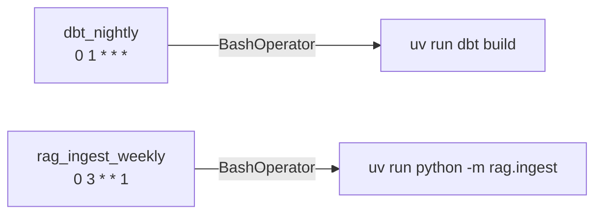

# airflow/

Two DAGs orchestrate the batch-side of the project. Airflow 2.10 LocalExecutor,
identical local ↔ prod surface (LocalExecutor inside the EC2 box in TM-A5).

## DAGs

| DAG | Schedule | What it runs |
|-----|----------|--------------|
| `dbt_nightly` | `0 1 * * *` (UTC) | `uv run dbt build --target dev` over the dbt project |
| `rag_ingest_weekly` | `0 3 * * 1` (UTC, Monday) | `uv run python -m rag.ingest` (idempotent on HTTP 304) |



A third DAG, `static_ingest`, is **deferred** until a `ref.lines` /
`ref.stations` loader exists. Adding it is one ADR away.

## Shared defaults

```python
default_args = {
    "owner": "tfl-monitor",
    "retries": 2,
    "retry_delay": timedelta(minutes=5),
}

@dag(
    dag_id="dbt_nightly",
    schedule="0 1 * * *",
    catchup=False,
    max_active_runs=1,
    default_args=default_args,
)
```

`catchup=False` — backfilling several months of dbt builds on first deploy
would burn warehouse budget for no value.
`max_active_runs=1` — one nightly build at a time; a stuck run does not
double-book.

## Local boot

```bash
make up         # starts Airflow alongside Postgres + Redpanda
# webserver: http://localhost:8080  (admin / admin in dev)
```

The Airflow image is multi-stage and bakes the project source into
`/opt/tfl-monitor`. dbt builds run inside the scheduler container by
shelling out to `uv run`.

## Tests

`tests/airflow/` contains four hermetic DAG-parse tests. They are excluded
from the default `pytest` invocation via the `airflow` marker; opt in with:

```bash
uv run pytest -m airflow tests/airflow -v
# or
make airflow-test
```

Tests assert each DAG parses, has the expected `dag_id`, the documented
schedule, and the expected number of tasks.

## Hosting

| Environment | How |
|-------------|-----|
| Local | `make up` brings up scheduler + webserver alongside Postgres / Redpanda |
| Production | TM-A5 collapses scheduler + webserver onto the single EC2 box; logs land in a docker volume on the host |

No remote logging in v1 — Logfire covers application traces; Airflow's task
log volume is sufficient for portfolio-scale debugging.
