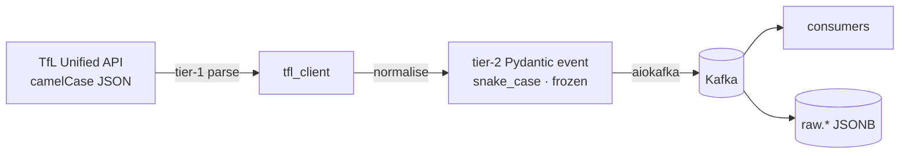

# contracts/

Single source of truth for every interface that crosses a service boundary.
**Changes here require an ADR in `.claude/adrs/` and a cross-track broadcast.**

## What lives here

```text
contracts/
├─ openapi.yaml               # OpenAPI 3.1 spec — every HTTP endpoint
├─ schemas/                   # Pydantic v2 — Kafka events
│  ├─ tfl_api.py              # tier-1: raw TfL Unified API shapes
│  ├─ line_status.py          # tier-2: internal Kafka event
│  ├─ arrivals.py             # tier-2: internal Kafka event
│  └─ disruptions.py          # tier-2: internal Kafka event
├─ sql/                       # Postgres DDL applied in numeric order
│  ├─ 001_raw.sql             # raw.* tables (JSONB landing)
│  ├─ 002_ref.sql             # ref.* lookups (lines, stations, modes)
│  ├─ 003_analytics.sql       # analytics.* schema (dbt target)
│  └─ 004_chat.sql            # analytics.chat_messages (TM-D5)
└─ dbt_sources.yml            # dbt sources — copied into dbt/sources/tfl.yml
```

## Two-tier schema model



| Tier | Where | Cardinality | Stability |
|------|-------|-------------|-----------|
| **Tier-1** | `schemas/tfl_api.py` | One model per TfL response shape | Optional-heavy; evolves at TfL's pace |
| **Tier-2** | `schemas/{topic}.py` | One model per Kafka event | Frozen; every consumer reads one shape |

Normalisation tier-1 → tier-2 is the ingestion client's job
(`src/ingestion/tfl_client/normalise.py`). Synthetic SHA-256 IDs anchor
disruptions whose upstream payload omits a stable identifier.

## CI invariants

| Drift gate | Mechanism |
|------------|-----------|
| `dbt_sources.yml` ↔ `dbt/sources/tfl.yml` | Bash diff in `.github/workflows/ci.yml` |
| `openapi.yaml` ↔ FastAPI emitted OpenAPI | Pytest test in `tests/api/test_openapi_drift.py` |
| `openapi.yaml` ↔ `web/lib/types.ts` | `pnpm exec openapi-typescript` regenerated and diffed in CI |

## Adding to the contract

Any change under `contracts/` triggers four downstream updates — three
artefact regenerations and one ADR:

1. `make openapi-ts` — re-emit `web/lib/types.ts` from the spec.
2. Run `psql -f contracts/sql/00X_*.sql` against the dev DB.
3. Re-copy `dbt_sources.yml` into `dbt/sources/tfl.yml` (or update both in
   the same commit).
4. Write an ADR at `.claude/adrs/NNN-title.md` explaining the change.

The PR title must be prefixed with `contract:` so reviewers know to look.
