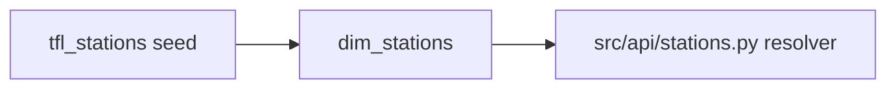

# dbt/

A lean dbt project: one seed (`tfl_stations`) and one mart (`dim_stations`).
The warehouse — `raw.*` landing tables, the staging models, and the
reliability / bus / disruptions marts — was removed in ADR 014; the app reads
TfL state live instead of modelling historical feeds.

## Layout

```text
dbt/
├─ dbt_project.yml         # project metadata + path config
├─ profiles.yml            # dev + ci targets (Postgres)
├─ sources/
│  └─ tfl.yml              # mirror of contracts/dbt_sources.yml (tfl_ref)
├─ seeds/
│  └─ tfl_stations.csv     # static NaPTAN ↔ station-name reference
└─ models/marts/
   └─ dim_stations.sql     # NaPTAN → name dimension (wraps the seed)
```

## Lineage



`dim_stations` is the fast path for resolving NaPTAN codes in disruption
payloads to station names; misses fall back to the live TfL `/StopPoint`
lookup (`src/api/stations.py`).

## Build

```bash
uv run task dbt-parse        # compile-only check (CI gate)
uv run task dbt-build        # seed + dim_stations + tests against the dev profile
```

In production, `scripts/cron-dbt-run.sh` runs `dbt build --select +dim_stations`
once per deploy (after the API healthcheck) — there is no recurring cron.

## Source-of-truth invariant

`dbt/sources/tfl.yml` is a **byte-for-byte mirror** of
`contracts/dbt_sources.yml`. CI gates the diff (`make sync-dbt-sources`
regenerates it). Updating one without the other fails the lint job.
