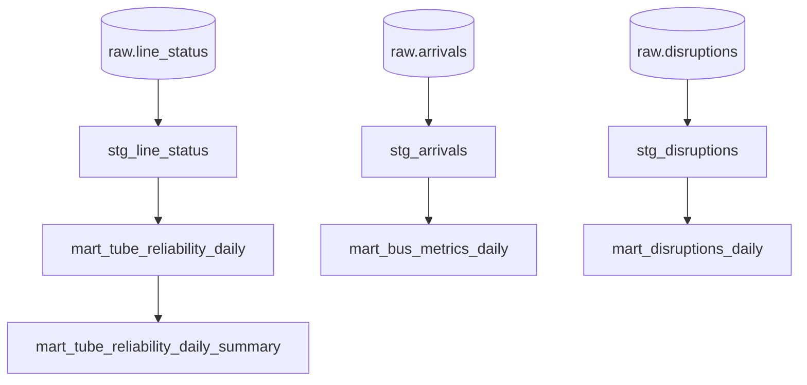

# dbt/

Postgres warehouse modelled in dbt — three staging models, four marts, five
exposures, generic + singular tests, and lineage that ships with the code.

## Layout

```text
dbt/
├─ dbt_project.yml         # project metadata + path config
├─ profiles.yml            # dev + ci targets (Postgres)
├─ sources/
│  └─ tfl.yml              # mirror of contracts/dbt_sources.yml
├─ models/
│  ├─ staging/             # stg_line_status, stg_arrivals, stg_disruptions
│  └─ marts/               # mart_tube_reliability_*, mart_disruptions_*, mart_bus_metrics_*
├─ tests/                  # 8 singular tests
└─ exposures.yml           # 5 exposures wiring marts to API endpoints
```

## Lineage



## Materialisation strategy

| Layer | Materialisation | Notes |
|-------|-----------------|-------|
| Staging | `incremental` `merge` on `event_id`, 5-min lookback, `on_schema_change='fail'` | Defensive `row_number()` dedup |
| Marts | `incremental` `merge` on composite grain | `(line_id, calendar_date_utc[, status_severity])` |

`merge` is preferred over `delete+insert` for idempotent re-runs across late
arrivals.

## Local development

```bash
uv run task dbt-parse        # compile-only check (CI gate)
uv run task dbt-build        # full build + tests against the dev profile
uv run task dbt-run          # models only
uv run task dbt-test          # tests only
```

The `dev` profile reads `POSTGRES_*` env vars; `ci` reads them from the
GitHub Actions service container.

## Tests

| Type | Count | Examples |
|------|-------|----------|
| Generic | 14 | `unique`, `not_null`, `accepted_values`, `relationships` |
| Singular | 8 | `pct_good_service ∈ [0, 100]`; `affected_routes` is valid JSONB; disruption category enum |

Singular tests live under `dbt/tests/` and are picked up by `dbt test` /
`dbt build` automatically.

## Source-of-truth invariant

`dbt/sources/tfl.yml` is a **byte-for-byte mirror** of
`contracts/dbt_sources.yml`. CI gates the diff. Updating one without the
other fails the lint job.
