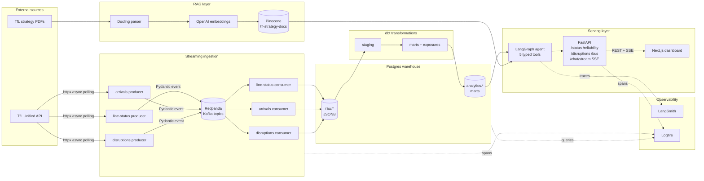
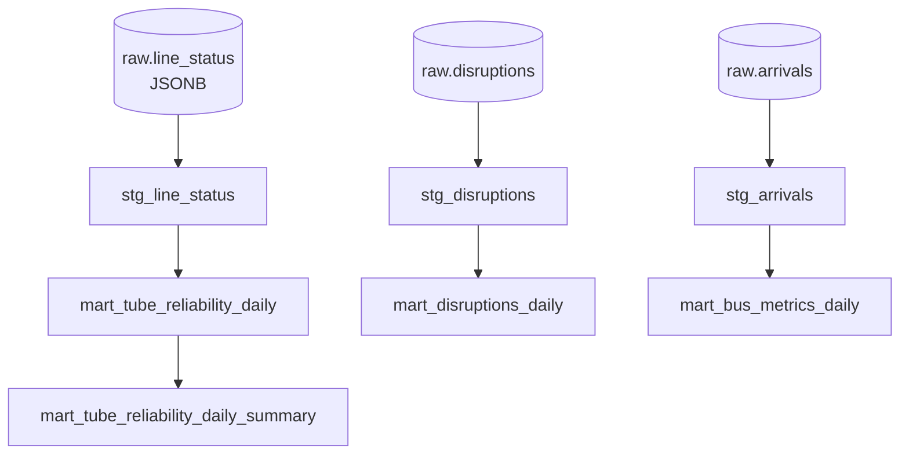
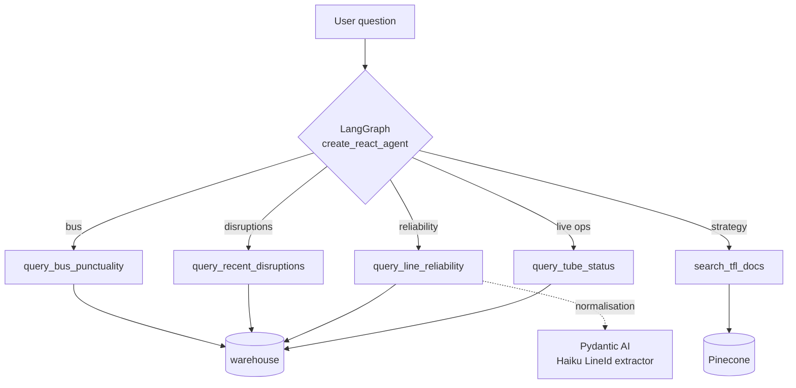
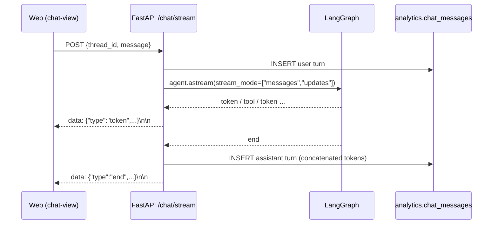
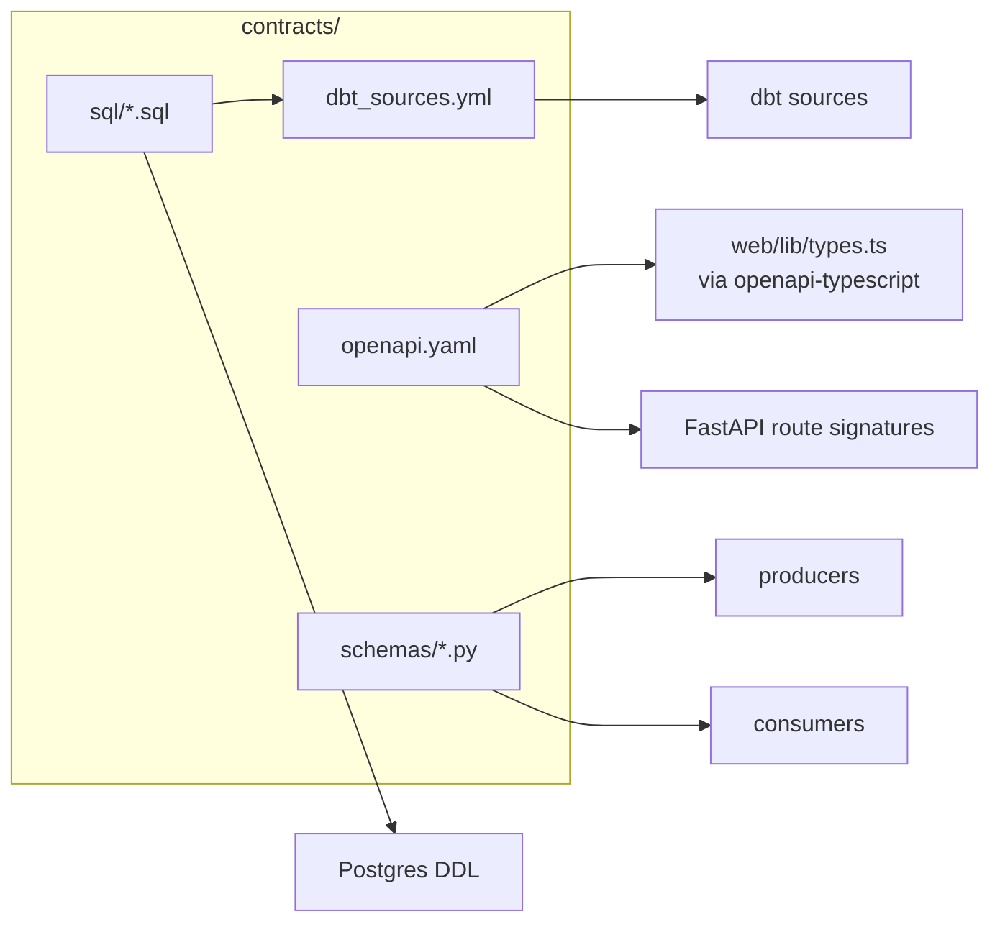

# Architecture

A bird's-eye view of how data flows from TfL into the dashboard, with every
component pinned to a directory in the repo.

## System diagram

## Component-to-directory map

| Layer | Directory | Runtime |
|-------|-----------|---------|
| Async TfL client | [`src/ingestion/tfl_client/`](https://github.com/hcslomeu/tfl-monitor/tree/main/src/ingestion/tfl_client) | Python 3.12 |
| Producers (×3) | [`src/ingestion/producers/`](https://github.com/hcslomeu/tfl-monitor/tree/main/src/ingestion/producers) | aiokafka |
| Consumers (×3) | [`src/ingestion/consumers/`](https://github.com/hcslomeu/tfl-monitor/tree/main/src/ingestion/consumers) | aiokafka + psycopg |
| Broker | [`docker-compose.yml`](https://github.com/hcslomeu/tfl-monitor/blob/main/docker-compose.yml) | Redpanda local; Redpanda Cloud prod |
| Warehouse | `raw.*`, `ref.*`, `analytics.*` schemas | Postgres 16 / Supabase |
| dbt project | [`dbt/`](https://github.com/hcslomeu/tfl-monitor/tree/main/dbt) | dbt-core 1.9 |
| Orchestration | [`airflow/dags/`](https://github.com/hcslomeu/tfl-monitor/tree/main/airflow/dags) | Airflow 2.10 LocalExecutor |
| RAG ingestion | [`src/rag/`](https://github.com/hcslomeu/tfl-monitor/tree/main/src/rag) | Docling + OpenAI + Pinecone |
| Agent | [`src/api/agent/`](https://github.com/hcslomeu/tfl-monitor/tree/main/src/api/agent) | LangGraph + Pydantic AI |
| API | [`src/api/`](https://github.com/hcslomeu/tfl-monitor/tree/main/src/api) | FastAPI + sse-starlette |
| Frontend | [`web/`](https://github.com/hcslomeu/tfl-monitor/tree/main/web) | Next.js 16 + shadcn |
| Contracts | [`contracts/`](https://github.com/hcslomeu/tfl-monitor/tree/main/contracts) | OpenAPI + Pydantic + SQL DDL |

## Data flow walkthrough

### 1. Producers poll TfL and emit Pydantic events

Each producer is an async daemon that wakes on a fixed cadence
(`LineStatusProducer` every 30 s, `ArrivalsProducer` every 30 s across 5 NaPTAN
hubs, `DisruptionsProducer` every 300 s across 4 modes), normalises the tier-1
TfL payload into a tier-2 [Pydantic event](pipelines/ingestion.md#contracts),
and publishes to Kafka with `acks="all"` and a stable partition key.

### 2. Consumers idempotently land into `raw.*`

`RawEventConsumer[E]` is generic over the event type; `RawEventWriter(table)`
runs `INSERT … ON CONFLICT (event_id) DO NOTHING` over a single async psycopg
connection with reconnect-on-`OperationalError`. Lag is traced on every span.

### 3. dbt stages and marts

Staging models (`stg_line_status`, `stg_arrivals`, `stg_disruptions`) unnest
JSONB into typed columns with defensive `row_number()` dedup. Marts are
incremental `merge` on stable composite grains and ship with generic + singular
tests.

### 4. RAG ingest is conditional and idempotent

`uv run python -m rag.ingest` resolves the live PDF URL on each landing page,
issues conditional `If-None-Match` / `If-Modified-Since` GETs, parses with
Docling's `HybridChunker`, async-batches OpenAI embeddings (100/req, retry on
429), and upserts into Pinecone with `sha256("{url}::{idx}")` ids — one
namespace per document, delete-namespace-on-rollover for clean idempotency.

### 5. Agent fans out across five typed tools

`compile_agent` returns `None` if any of `ANTHROPIC_API_KEY` / `OPENAI_API_KEY`
/ `PINECONE_API_KEY` is missing, so `/chat/stream` 503s while the history
endpoint keeps working off `DATABASE_URL` alone.

### 6. SSE projection over LangGraph events

## Contracts

`contracts/` is the single source of truth for every cross-service interface:

Two tiers of Pydantic schemas separate the messy outside world from the clean
internal wire format — see [tier-1 vs tier-2](pipelines/ingestion.md#contracts).

## Related ADRs

The handful of cross-cutting decisions worth a paper trail:

- [001 — Redpanda over Apache Kafka](https://github.com/hcslomeu/tfl-monitor/blob/main/.claude/adrs/001-redpanda-over-kafka.md)
- [002 — Contracts-first parallelism](https://github.com/hcslomeu/tfl-monitor/blob/main/.claude/adrs/002-contracts-first.md)
- [003 — Airflow on Railway](https://github.com/hcslomeu/tfl-monitor/blob/main/.claude/adrs/003-airflow-on-railway.md) (superseded by 006)
- [004 — Logfire + LangSmith split](https://github.com/hcslomeu/tfl-monitor/blob/main/.claude/adrs/004-logfire-langsmith-split.md)
- [005 — Raw-table defaults](https://github.com/hcslomeu/tfl-monitor/blob/main/.claude/adrs/005-raw-table-defaults.md)
- 006 — AWS Bedrock + single-EC2 deploy *(landing with TM-A5)*
