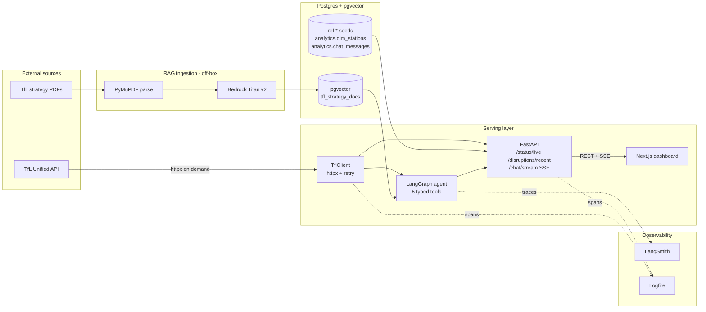
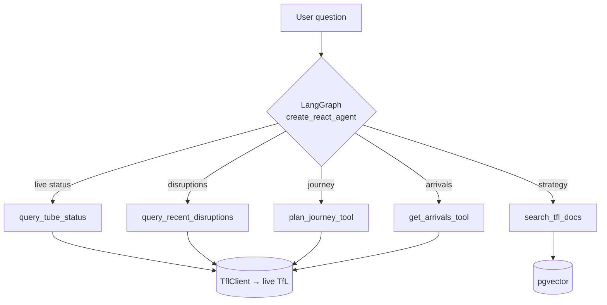
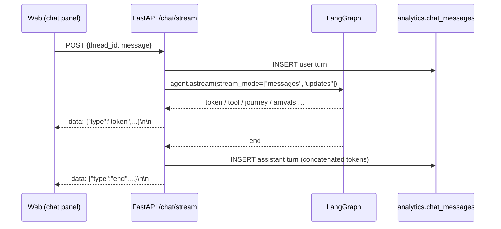
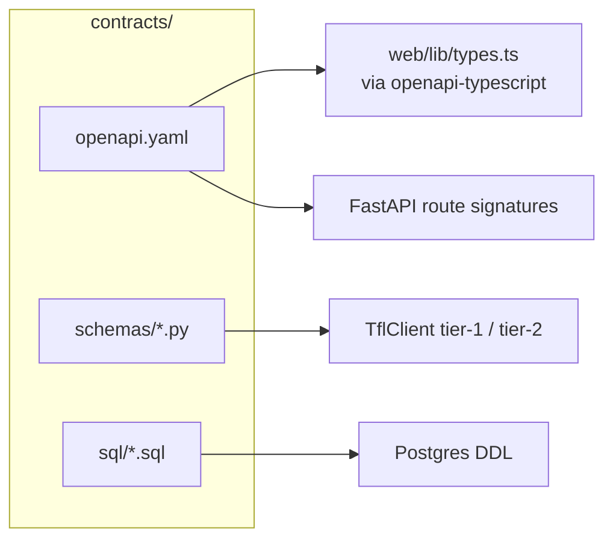

# Architecture

A bird's-eye view of how a request flows from the dashboard to TfL and back,
with every component pinned to a directory in the repo. The app is a **live TfL
proxy + RAG chat** — it reads through to TfL on demand and serves a LangGraph
agent over TfL strategy documents (ADR 014; no broker, no feed warehouse).

## System diagram

## Component-to-directory map

| Layer | Directory | Runtime |
|-------|-----------|---------|
| Async TfL client | [`src/ingestion/tfl_client/`](https://github.com/hcslomeu/tfl-monitor/tree/main/src/ingestion/tfl_client) | Python 3.12 · httpx |
| Read-through endpoints | [`src/api/live.py`](https://github.com/hcslomeu/tfl-monitor/blob/main/src/api/live.py) | FastAPI |
| Station resolver | [`src/api/stations.py`](https://github.com/hcslomeu/tfl-monitor/blob/main/src/api/stations.py) | psycopg + TfL fallback |
| dbt project (seed + `dim_stations`) | [`dbt/`](https://github.com/hcslomeu/tfl-monitor/tree/main/dbt) | dbt-core + dbt-postgres |
| RAG ingestion | [`src/rag/`](https://github.com/hcslomeu/tfl-monitor/tree/main/src/rag) | PyMuPDF + Bedrock Titan + pgvector |
| Agent | [`src/api/agent/`](https://github.com/hcslomeu/tfl-monitor/tree/main/src/api/agent) | LangGraph + Pydantic AI |
| API | [`src/api/`](https://github.com/hcslomeu/tfl-monitor/tree/main/src/api) | FastAPI + sse-starlette |
| Frontend | [`web/`](https://github.com/hcslomeu/tfl-monitor/tree/main/web) | Next.js 16 + shadcn |
| Contracts | [`contracts/`](https://github.com/hcslomeu/tfl-monitor/tree/main/contracts) | OpenAPI + Pydantic + SQL DDL |
| Deploy | [`infra/`](https://github.com/hcslomeu/tfl-monitor/tree/main/infra) | docker compose on shared Lightsail |

## Data flow walkthrough

### 1. The API reads TfL on demand

`/status/live` and `/disruptions/recent` call `TflClient` directly
(`src/api/live.py`), normalise the tier-1 payload into the tier-2 response
shape, and return it. Nothing is persisted; an upstream failure surfaces as
RFC 7807 `502`. See [Live TfL proxy](pipelines/ingestion.md).

### 2. Reference data is a static dbt layer

The only dbt artifacts are the `tfl_stations` seed and the
`analytics.dim_stations` mart built from it — the fast path for the NaPTAN →
station-name resolver. Built one-shot on deploy, never on a schedule. See
[Reference data](pipelines/warehouse.md).

### 3. RAG ingest is conditional and idempotent

`uv run python -m rag.ingest` resolves the live PDF URL on each landing page,
issues conditional `If-None-Match` / `If-Modified-Since` GETs, extracts text
with PyMuPDF, chunks with LlamaIndex's `SentenceSplitter`, embeds with AWS
Bedrock Titan v2 (1024-dim), and upserts into the pgvector `tfl_strategy_docs`
table with stable ids — keyed by `doc_id` metadata for per-document targeting.
See [RAG ingestion](pipelines/rag.md).

### 4. The agent fans out across five typed tools

The live and journey/arrivals tools register only when a `TflClient` is wired;
`search_tfl_docs` registers only when a retriever is available. `compile_agent`
returns `None` if the LLM credentials are missing, so `/chat/stream` 503s while
`/chat/{thread_id}/history` keeps working off `DATABASE_URL` alone. See
[LangGraph agent](pipelines/agent.md).

### 5. SSE projection over LangGraph events

## Contracts

`contracts/` is the single source of truth for every cross-service interface:

Two tiers of Pydantic schemas separate the messy outside world from the clean
internal shape — see [tier-1 vs tier-2](pipelines/ingestion.md#contracts).

## Related ADRs

The cross-cutting decisions worth a paper trail (full set under
[`.claude/adrs/`](https://github.com/hcslomeu/tfl-monitor/tree/main/.claude/adrs)):

- [002 — Contracts-first parallelism](https://github.com/hcslomeu/tfl-monitor/blob/main/.claude/adrs/002-contracts-first.md)
- [004 — Logfire + LangSmith split](https://github.com/hcslomeu/tfl-monitor/blob/main/.claude/adrs/004-logfire-langsmith-split.md)
- [006 — AWS Bedrock + shared-box deploy](https://github.com/hcslomeu/tfl-monitor/blob/main/.claude/adrs/006-aws-deploy.md)
- [007 — Disruption affected-stops shape](https://github.com/hcslomeu/tfl-monitor/blob/main/.claude/adrs/007-disruption-affected-stops-shape.md)
- [008 — Remove Airflow for SQLAlchemy 2.0](https://github.com/hcslomeu/tfl-monitor/blob/main/.claude/adrs/008-remove-airflow-for-sqlalchemy2.md)
- [010 — TfL hub → rail-child dereference](https://github.com/hcslomeu/tfl-monitor/blob/main/.claude/adrs/010-tfl-hub-children.md)
- [011 — Structured journey/arrivals SSE frames](https://github.com/hcslomeu/tfl-monitor/blob/main/.claude/adrs/011-structured-journey-arrivals-sse-frames.md)
- [013 — PyMuPDF over Docling](https://github.com/hcslomeu/tfl-monitor/blob/main/.claude/adrs/013-pymupdf-over-docling.md)
- [014 — Decommission the warehouse → live proxy](https://github.com/hcslomeu/tfl-monitor/blob/main/.claude/adrs/014-decommission-warehouse-live-proxy.md) *(supersedes 001 + 005)*
