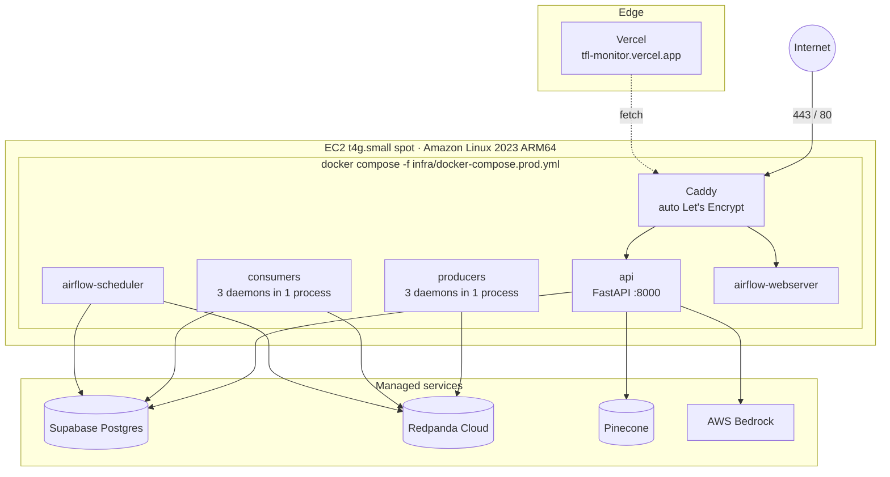
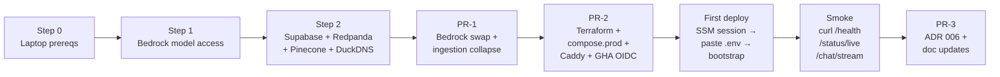
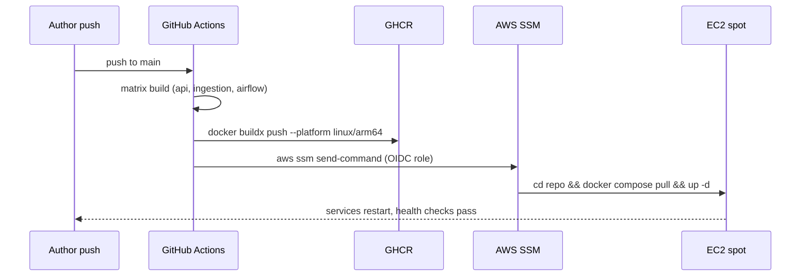

# Deployment

The production stack is intentionally minimalist: **one EC2 spot instance**
runs the existing docker-compose layout, **AWS Bedrock** powers the LLM, and
every other tier rides on a free plan. The full design is locked in
[`.claude/specs/TM-A5-plan.md`](https://github.com/hcslomeu/tfl-monitor/blob/main/.claude/specs/TM-A5-plan.md).

## Cost lock

| Layer | Host | Tier | $/mo |
|-------|------|------|------|
| Backend compute | AWS EC2 t4g.small **spot** (`us-east-1`) via ASG min=max=1 | persistent spot | ~3-4 |
| LLM | AWS Bedrock — `claude-3-5-sonnet-20241022-v2:0` + `claude-3-5-haiku-20241022-v1:0` | on-demand | ~2-3 |
| Postgres warehouse + Airflow metadata | Supabase | free | 0 |
| Kafka broker | Redpanda Cloud Serverless | free | 0 |
| Frontend | Vercel | hobby | 0 |
| Vector DB | Pinecone serverless | free | 0 |
| HTTPS termination | DuckDNS subdomain + Caddy auto Let's Encrypt | — | 0 |
| Image registry | GHCR (public repo) | free | 0 |
| Observability | Logfire + LangSmith | free | 0 |
| Bandwidth (≈1 GB egress/mo) | AWS | — | ~0.10 |
| **Steady-state target** | | | **~$5-8** |

A CloudWatch billing alarm fires at $20/mo as the safety net (~10× the
expected burn).

## Topology on the box



Six long-running services on one box (down from 9 in local dev): three
ingestion producers and three consumers each collapsed into one `asyncio.gather`
process, plus Airflow (scheduler + webserver), the FastAPI process, and
Caddy.

## What changed from the original plan

The first iteration of TM-A5 targeted Railway for the backend. Two budget
constraints flipped the design:

1. The author has **$100 of AWS credit** to spread across two portfolio
   projects, so AWS-only compute is now essentially free.
2. Anthropic-direct API spend is real money; **Bedrock pricing** for the same
   models lands in the same $100 credit envelope.

Hence:

- Single EC2 spot replaces Railway's API + worker boxes.
- Bedrock replaces Anthropic-direct in production (`ChatBedrockConverse` +
  `pydantic-ai "bedrock:..."` model strings).
- Anthropic-direct stays as an opt-in **local-dev fallback** so contributors
  who only have an Anthropic key can still run the agent.

ADR 003 (Airflow on Railway) becomes superseded by ADR 006 (Bedrock +
single-EC2 deploy), committed alongside TM-A5.

## Provisioning runbook (high-level)

The full step-by-step runbook lives in
[`.claude/specs/TM-A5-plan.md` §3](https://github.com/hcslomeu/tfl-monitor/blob/main/.claude/specs/TM-A5-plan.md).



## Three PRs under the TM-A5 banner

| # | Branch | Tracks | Approx LoC |
|---|--------|--------|-----------|
| **PR-1** | `feature/TM-A5-bedrock-swap` | D-api-agent + B-ingestion (declared cross-track) | ~200 src + 80 tests |
| **PR-2** | `feature/TM-A5-aws-deploy` | A-infra | ~450 |
| **PR-3** | `feature/TM-A5-adr-progress` | meta (ADRs + ARCHITECTURE / README / PROGRESS) | ~250 markdown |

## Image build + deploy pipeline



Authentication chain:

1. GitHub OIDC token → IAM role with `ssm:SendCommand`.
2. EC2 instance profile with `bedrock:InvokeModel*` scoped to the two model
   ARNs only — no AWS access keys live anywhere on disk.
3. GHCR pull on the box uses a short-lived `read:packages` PAT pasted once
   into `.env`.

## Reverse proxy + TLS

```caddy
{
    email tflmonitor@example.com
}

tflmonitor.duckdns.org {
    handle_path /airflow* {
        reverse_proxy airflow-webserver:8080
    }
    reverse_proxy api:8000 {
        flush_interval -1   # disable buffering for SSE
    }
}
```

`flush_interval -1` is the difference between SSE working and timing out —
Caddy buffers by default, which breaks the chat stream.

DuckDNS keeps `tflmonitor.duckdns.org` pointed at the EIP via a 5-minute cron
on the box. Re-pointing to a custom domain in TM-F1 is one Caddyfile line.

## Disaster scenarios

| Risk | Response |
|------|----------|
| Spot interruption | ASG re-launches on `persistent` spot; ~5 min downtime per event, ~1-2× / week |
| EBS volume loss on spot reclaim | `delete_on_termination = false` preserves the volume; ASG re-attaches |
| Bedrock model access denied | Fall back to Anthropic-direct via `.env` (`unset BEDROCK_REGION` + set `ANTHROPIC_API_KEY`) |
| RAM saturation on t4g.small | Drop Airflow webserver (CLI-only operations) — saves ~250 MB |
| Free-tier expiry on Supabase / Redpanda / Pinecone | All three are indefinite at portfolio scale; documented limits in README |
| Bedrock cost spike | CloudWatch billing alarm @ $20/mo notifies via SNS |

## Rollback paths

Three granularities:

1. **Per-image** — `docker compose pull` against a previous SHA tag (GHCR
   retains all SHA tags).
2. **Per-PR** — `git revert -m 1 <merge-sha>` then `terraform apply`.
3. **Whole-pivot** — revert the three TM-A5 PRs and ship ADR 003's Railway
   plan (preserved in git history).
