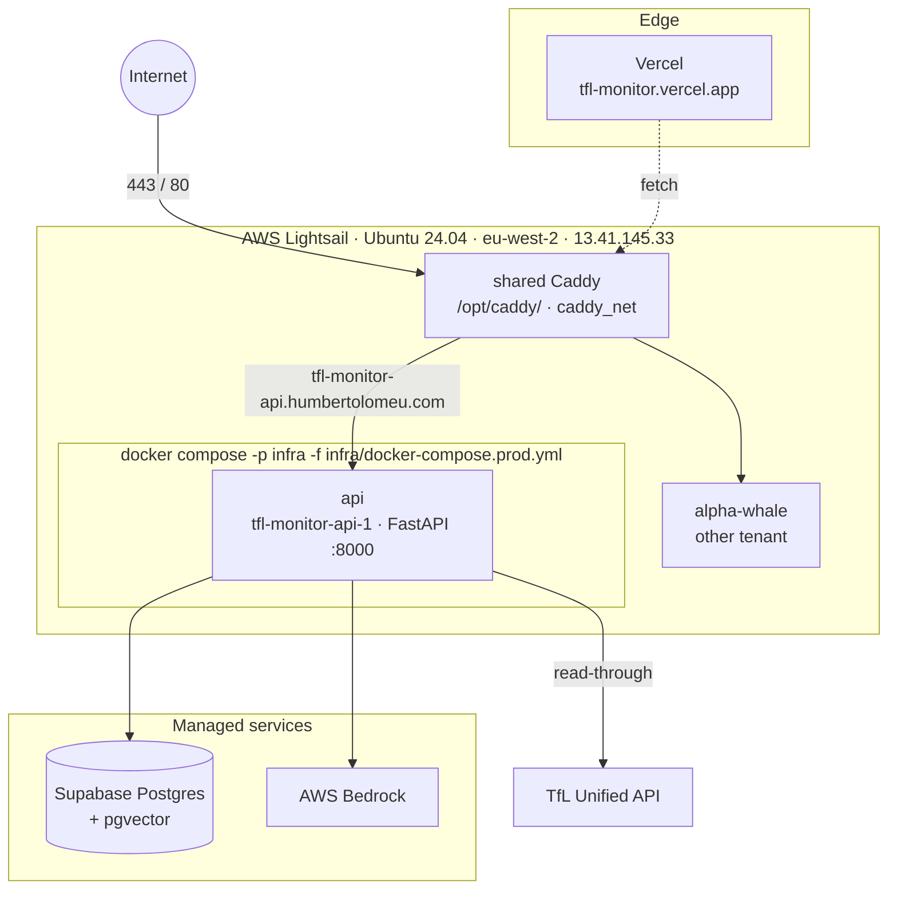

# Deployment

The production stack is intentionally minimalist: the API runs as a **single
container on a shared AWS Lightsail box**, **AWS Bedrock** powers the LLM, and
every other tier rides on a free plan. There is no broker and no ingestion
worker — the app reads TfL live (ADR 014). The infra is locked in
[`infra/README.md`](https://github.com/hcslomeu/tfl-monitor/blob/main/infra/README.md)
and ADR 006.

## Cost lock

tfl-monitor is a **second tenant** on a Lightsail box it shares with
`alpha-whale` and future portfolio projects, so the $10/mo box splits roughly
three ways.

| Layer | Host | Tier | $/mo |
|-------|------|------|------|
| Backend compute | Shared AWS Lightsail (eu-west-2, 2 GB RAM, 60 GB SSD) | shared $10 box | ~3.50 effective |
| LLM | AWS Bedrock — Claude Sonnet 4.5 + Haiku 4.5 (`eu.anthropic.*` inference profiles) | on-demand | ~2-3 |
| Postgres + pgvector | Supabase | free | 0 |
| Frontend | Vercel | hobby | 0 |
| HTTPS termination | shared Caddy + Let's Encrypt + Cloudflare DNS-only | — | 0 |
| Image build | on-box `docker compose --build` | — | 0 |
| Observability | Logfire + LangSmith | free | 0 |
| **Steady-state target** | | | **~$5-7** |

A CloudWatch billing alarm guards the Bedrock spend.

## Topology on the box



One long-running container for tfl-monitor (`tfl-monitor-api-1`, compose project
`infra`). The producers, consumers, broker, and Airflow that the original design
ran are all gone (ADR 014 / ADR 008).

## DNS + reverse proxy

- **DNS:** a Cloudflare A record `tfl-monitor-api.humbertolomeu.com` → the static
  IP, **DNS-only** (gray cloud) — no Cloudflare proxy, no Origin Cert.
- **TLS:** the shared Caddy at `/opt/caddy/` joins the external `caddy_net`
  docker network and reverse-proxies the hostname to `tfl-monitor-api-1:8000`,
  issuing a Let's Encrypt cert via HTTP-01. `infra/caddyfile.snippet` is the
  source of truth for the tfl-monitor site block, merged once into
  `/opt/caddy/Caddyfile`.

SSE needs `flush_interval -1` in the Caddy site block — Caddy buffers by
default, which times out the chat stream.

## LLM access

AWS Bedrock cross-region inference profiles serve Claude Sonnet 4.5 (answers)
and Haiku 4.5 (extraction), authenticated through a scoped `tfl-monitor-bedrock`
IAM user — Lightsail has no native instance role, so the access keys live in
`/opt/tfl-monitor/.env` (chmod 600). Anthropic-direct stays as an opt-in
local-dev fallback for contributors who only have an Anthropic key.

## Deploy pipeline

```mermaid
sequenceDiagram
    participant Dev as push to main
    participant GHA as GitHub Actions
    participant BOX as Lightsail box
    participant TFL as deploy.sh

    Dev->>GHA: push (backend paths only)
    GHA->>BOX: rsync source (pinned host key)
    GHA->>BOX: ssh (keepalive) → bash scripts/deploy.sh
    TFL->>TFL: docker compose -p infra up -d --build
    TFL->>TFL: internal + external healthcheck
    TFL->>TFL: one-shot dbt seed + dim_stations build
    BOX-->>Dev: /health 200
```

`.github/workflows/deploy.yml` triggers on push to `main`, ignoring
markdown / `web/` / `.claude/` / `docs/` changes. Hardening learned the hard way
(see the napkin): `set -o pipefail` through every pipe so `docker compose … | tail`
can't mask a build failure; `ssh -o ServerAliveInterval=60` so buildkit's silent
unpack phase doesn't drop the connection; a pinned `LIGHTSAIL_HOST_KEY` to close
the keyscan TOFU window.

`scripts/deploy.sh` also removes any legacy cron schedule (ADR 014 dropped the
recurring dbt + retention cron) and runs a **one-shot** `dbt seed` +
`dim_stations` build after the health check — non-fatal, because the
station-name resolver falls back to a live TfL `/StopPoint` lookup when
`dim_stations` is absent.

## Operations

| Action | Command |
|--------|---------|
| SSH to the box | `ssh ubuntu@13.41.145.33` |
| Public smoke | `curl -fsS https://tfl-monitor-api.humbertolomeu.com/health` |
| Recreate the API container | `cd /opt/tfl-monitor && docker compose -p infra -f infra/docker-compose.prod.yml up -d --force-recreate` |
| Manual dbt rebuild | `ssh ubuntu@13.41.145.33 '/opt/tfl-monitor/scripts/cron-dbt-run.sh'` |
| Reload Caddy | `docker exec shared-caddy caddy reload --config /etc/caddy/Caddyfile` |

!!! warning "Shared box etiquette"
    The box is a noisy-neighbour to two other tenants on 2 GB of RAM. Never run
    a multi-GB-RAM job (RAG ingest, torch) on it — that OOMs the guest kernel and
    takes every tenant down. Run RAG ingest off-box against the same Supabase
    pgvector DSN. Use the `-p infra` project name for every compose op so it
    targets `tfl-monitor-api-1` and not the local-dev stack.

## What changed from the original plan

The first TM-A5 iteration targeted a dedicated EC2 spot box on DuckDNS with a
full 6-service compose (producers, consumers, Airflow). Two shifts collapsed it:

1. An existing 2 GB Lightsail box had spare capacity, so tfl-monitor became a
   second tenant behind a shared Caddy — cheaper than a dedicated instance
   (ADR 006 supersedes ADR 003).
2. ADR 014 removed the broker, ingestion workers, and warehouse entirely, so the
   box now runs a single API container reading TfL live.

## Rollback paths

1. **Per-image** — `docker compose -p infra up -d` against a previous build /
   git checkout on the box.
2. **Per-PR** — `git revert -m 1 <merge-sha>`; the next push redeploys.
3. **LLM fallback** — unset the Bedrock vars and set `ANTHROPIC_API_KEY` in
   `/opt/tfl-monitor/.env` to fall back to Anthropic-direct.
