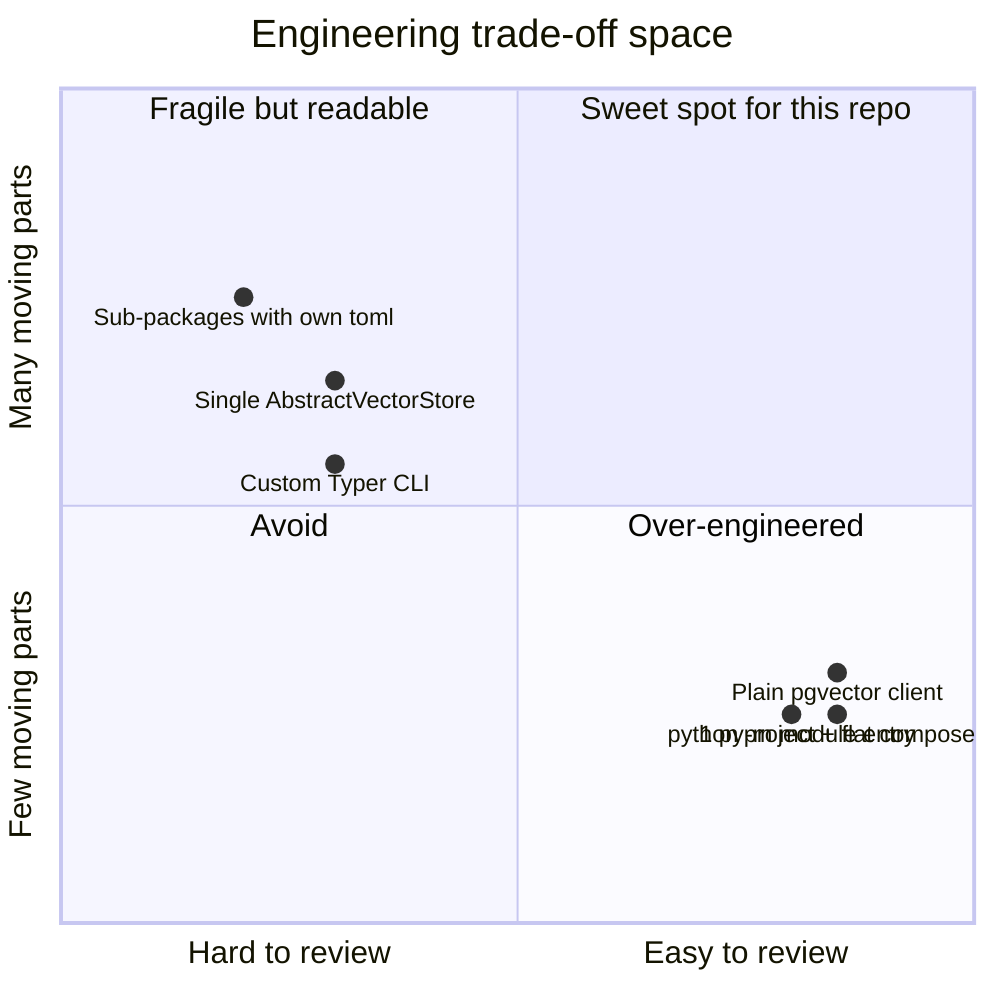
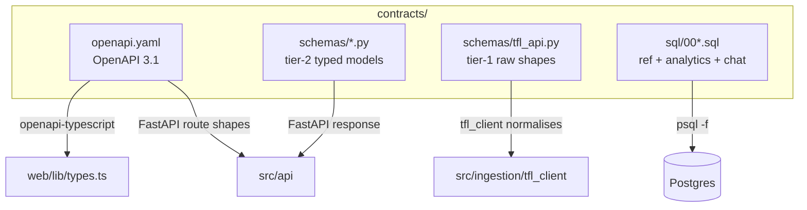
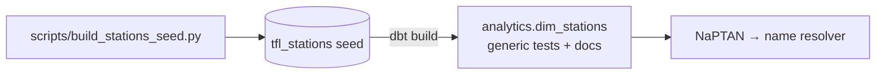
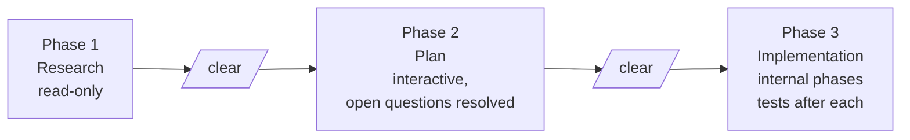

# Engineering principles

The principles below are not aspirations — they are review gates. Every PR is
checked against them by the author and by Codex (acting as a reviewer agent).

## Lean by default



The repo is reviewed by a human + Codex. Anything that takes Codex more than
30 s to understand *why* it exists is over-engineered.

## Four hard rules

| Rule | Meaning | In practice |
|------|---------|-------------|
| **DRY** | Don't Repeat Yourself | Search for an existing helper before writing a new one |
| **KISS** | Keep It Simple, Stupid | Prefer the most direct working solution |
| **YAGNI** | You Aren't Gonna Need It | Build only what the WP asks for |
| **SoC** | Separation of Concerns | One module, one purpose |

The pattern that flags every violation: *"is there a second consumer right
now?"* If no — the abstraction can wait.

## Contracts-first parallelism

Every cross-service interface lives in `contracts/`. Two tiers of Pydantic
schemas separate the messy outside world from the clean internal shape, so the
TfL client, FastAPI, and the frontend can be built in parallel by separate
agents without colliding.



CI enforces the source-of-truth via a bidirectional OpenAPI ↔ Python drift
test — the emitted schema must equal the committed contract, both directions.

## Live proxy over a warehouse

Hoarding TfL's feeds as warehouse history bought nothing but disk-full
incidents — the free-tier database was bricked three times before ADR 014
turned the app into a live proxy. The principle is YAGNI applied to data: TfL
already exposes the live API, so reading through on demand is simpler, cheaper,
and removes an entire failure class. A bounded-retention warehouse can return
under a future ADR if analytics ever justify it.

## dbt for the reference layer



For one seed and one model, raw SQL would also work — until a second person
reads the codebase. dbt buys us tests, lineage, and one-line documentation that
ships with the code, plus a one-command rebuild from an empty database.

## Agent that does not hallucinate

Two design choices keep the agent honest:

1. **Every tool has typed Pydantic input/output.** The model cannot call a tool
   with malformed arguments — a Pydantic AI Haiku normaliser canonicalises free
   text (e.g. a line name) into a validated struct first.
2. **Retrieval cites chunks.** The RAG tool returns pgvector chunks with their
   `doc_id` and `page` so any answer is traceable to a paragraph in a public
   document. LangSmith records the exact chunks that made it into the context.

If the answer hallucinates, the trace shows where — and the next iteration
prunes the bad retrieval, not "the LLM."

## Observability split

| Question | Tool |
|----------|------|
| How did the agent arrive at that answer? | LangSmith |
| Which chunks made it into the prompt? | LangSmith |
| How many tokens did this conversation cost? | LangSmith |
| Why is `/disruptions/recent` p99 latency high? | Logfire |
| Is TfL throttling us with 429s? | Logfire |
| Did the `dim_stations` resolver fall back to a live lookup? | Logfire |

Two hosted tools, zero self-hosted telemetry. ADR 004 has the full rationale.

## Security-first mindset

A short list of non-negotiables, enforced by Bandit + manual review:

- **Zero-trust** — never trust client data; revalidate on the backend.
- **Secrets** — `SecretStr` (Pydantic) and env vars; nothing in source.
- **Parameterised queries** — always; no f-string SQL.
- **CORS** — explicit allowlist; never `*` in production.
- **Security headers in Next.js** — `X-Frame-Options: DENY`,
  `X-Content-Type-Options: nosniff`,
  `Referrer-Policy: strict-origin-when-cross-origin`.
- **Bandit in CI** — blocks on HIGH severity.
- **Post-generation bug hunt** — after writing auth or data-handling code, ask
  *"how would a malicious user bypass this?"* before the PR opens.

## Three-phase WP delivery

For non-trivial WPs the agent runs three phases with `/clear` between them, so
each phase enters a fresh context window.



Every spec is a triple under `.claude/specs/`:

```text
TM-XXX-research.md
TM-XXX-plan.md
TM-XXX-spec.md   (older WPs only — newer ones merge into the plan)
```

Phase 3 stops if reality diverges from the plan and reports:

> "Expected: X. Found: Y. How should I proceed?"

This ships small, intentional PRs and avoids drift.

## Trivial vs non-trivial

| Type | Treatment |
|------|-----------|
| Typo, one-line fix, dependency bump | Direct PR, tests already cover it |
| New endpoint with one query | Plan inline, implement, ship |
| New live endpoint, new dbt model, new agent tool | Three phases, fresh context per phase |
| Anything touching `contracts/` | Mandatory ADR + cross-track broadcast |

Track boundaries (A-infra / B-ingestion / C-dbt / D-api-agent / E-frontend /
F-polish) keep at most two agents on the codebase concurrently without
collisions.
