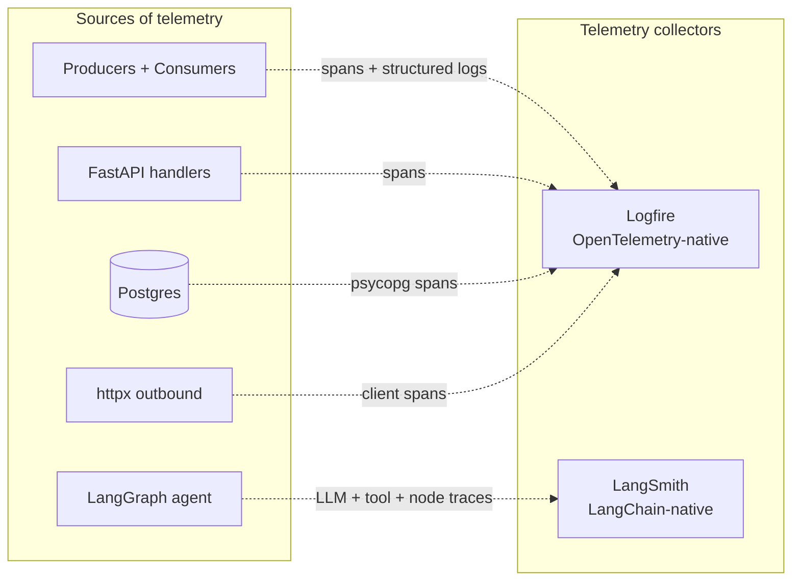
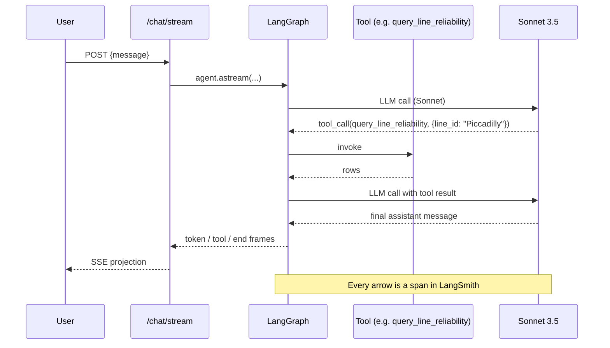

# Observability

Two hosted tools, clearly separated by concern. No self-hosted telemetry stack.



## What goes where

| Question | Tool |
|----------|------|
| How did the agent arrive at that answer? | **LangSmith** |
| Which chunks did the retriever pull? | **LangSmith** |
| How many tokens did this conversation cost? | **LangSmith** |
| Why did the router pick the SQL tool over RAG? | **LangSmith** |
| Which TfL endpoint is throttling us with 429s? | **Logfire** |
| Why is `/reliability/{line_id}` p99 latency high? | **Logfire** |
| Is the `arrivals` consumer keeping up with the topic? | **Logfire** |
| Did the Pinecone upsert succeed? | **Logfire** |

The split is captured formally in [ADR 004 — Logfire + LangSmith
split](https://github.com/hcslomeu/tfl-monitor/blob/main/.claude/adrs/004-logfire-langsmith-split.md).

## Logfire wiring

Initialised once in each service entrypoint:

```python
import logfire

logfire.configure(service_name="tfl-monitor-api")
logfire.instrument_fastapi(app)
logfire.instrument_psycopg()
logfire.instrument_httpx()
```

What this gives us out of the box:

- One span per FastAPI request, with route + status + duration.
- One span per psycopg query, with the parameterised SQL.
- One span per httpx outbound request, with the URL and status.
- Structured logs via `logfire.info("kafka.consume", lag=…, partition=…)`
  rather than `print()` or bare `logging`.

### Service boundaries traced

| Span namespace | Code path |
|----------------|-----------|
| `tfl-monitor-api` | FastAPI request handlers |
| `ingestion.line_status.*` | line-status producer + consumer |
| `ingestion.arrivals.*` | arrivals producer + consumer |
| `ingestion.disruptions.*` | disruptions producer + consumer |
| `kafka.produce`, `kafka.consume` | aiokafka events with lag |
| `httpx.client` | TfL Unified API calls (`app_key` redacted) |
| `psycopg.*` | Postgres queries |

`app_key` is **redacted before the span is emitted** — see
`src/ingestion/observability.py`.

## LangSmith wiring

Set three env vars and LangGraph + Pydantic AI auto-instrument:

```bash
LANGSMITH_TRACING=true
LANGSMITH_API_KEY=ls__...
LANGSMITH_PROJECT=tfl-monitor
```

What this gives us out of the box:

- One trace per `/chat/stream` invocation.
- One span per LangGraph node and per tool call within the trace.
- The exact chunks fed into the model context for each RAG retrieval.
- Token counts per call, per turn, and aggregated per session.

### Trace shape



## What we explicitly do not do

!!! danger "No custom observability"
    The `CLAUDE.md` policy forbids:

    - Prometheus / Grafana / Loki / Jaeger / OpenTelemetry collector sidecars.
    - Custom structured-logging wrappers around `logging`.
    - Custom token-cost dashboards.
    - Per-route metric emitters that duplicate what Logfire already captures.

    Two free-tier hosted tools are sufficient for a portfolio project. They
    also degrade gracefully — code paths still run if the tokens are missing.

## Cost

Both Logfire and LangSmith free tiers cover this project comfortably.

| Tool | Free tier | Project usage |
|------|-----------|---------------|
| Logfire | 10 GB ingest / month | <500 MB at portfolio cadence |
| LangSmith | 5 k traces / month, 14-day retention | <1 k traces / month |

A LangSmith paid tier becomes interesting only if the agent serves more than a
handful of recruiters; a budget alarm captures that gracefully.
