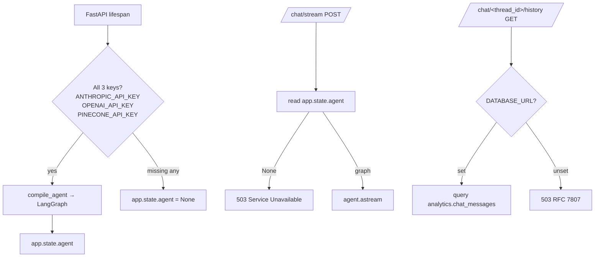
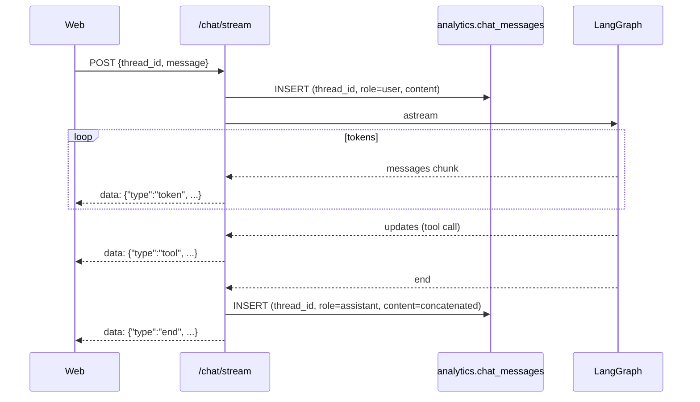

# LangGraph agent

A `create_react_agent` over **five typed tools** — four wrap the FastAPI
fetchers in-process, the fifth is a LlamaIndex retriever fanning out across
the three Pinecone namespaces. Streaming reaches the browser via SSE.

## Code map

| Concern | Module |
|---------|--------|
| Graph compilation | `src/api/agent/graph.py` |
| Tool wrappers (4 SQL + 1 RAG) | `src/api/agent/tools.py` |
| LlamaIndex retriever | `src/api/agent/rag_tool.py` |
| Pydantic AI normaliser | `src/api/agent/extraction.py` |
| SSE projection | `src/api/agent/streaming.py` |
| FastAPI route + history | `src/api/main.py` (`/chat/stream`, `/chat/{thread_id}/history`) |
| Persistence DDL | `contracts/sql/004_chat.sql` |

## Tool surface

```mermaid
graph LR
    Q[User question] --> AGENT["create_react_agent<br/>Sonnet 3.5 v2<br/>temperature=0"]
    AGENT --> T1[query_tube_status<br/>→ /status/live]
    AGENT --> T2[query_line_reliability<br/>→ /reliability/{line_id}]
    AGENT --> T3[query_recent_disruptions<br/>→ /disruptions/recent]
    AGENT --> T4[query_bus_punctuality<br/>→ /bus/{stop_id}/punctuality]
    AGENT --> T5[search_tfl_docs<br/>→ Pinecone retriever]

    T2 -.normalise.-> EXT["Pydantic AI<br/>Haiku 3.5<br/>LineId extractor"]

    T1 --> WH[(analytics.* via fetchers)]
    T2 --> WH
    T3 --> WH
    T4 --> WH
    T5 --> PC[(Pinecone<br/>3 namespaces)]
```

Each tool is a typed LangChain `@tool` that calls the same fetcher functions
backing the REST endpoints — there is **one source of truth per query** and
the agent does not duplicate SQL. Tool docstrings declare assumptions that
should reach the model:

> `query_bus_punctuality(stop_id: str)` — *Bus punctuality is a documented
> proxy: on-time = arrival within 5 min; early = > 5 min in advance; late =
> negative seconds. Anchored on TfL's published 5-minute bus performance KPI.*

## Pydantic AI inside one tool

The `LineId` extractor is the only Pydantic AI surface in the project:

```python
@lru_cache(maxsize=1)
def _normaliser() -> Agent[None, LineId]:
    return Agent(
        model=_haiku_model_string(),
        output_type=LineId,
        instructions=(
            "Extract the canonical TfL line ID from the user's question. "
            "Map informal names to slugs (e.g. 'Lizzy line' -> 'elizabeth')."
        ),
    )
```

Why Pydantic AI for this and not LangGraph?

- **Single shot, typed output** — Pydantic AI returns a validated `LineId`
  directly; LangGraph's full state machine is overkill.
- **Cheap model** — Haiku 3.5 with a one-shot prompt is ~10× cheaper than
  asking Sonnet to do this inside the main agent loop.
- **Cacheable** — `lru_cache(maxsize=1)` keeps the agent client warm across
  requests within the same FastAPI process.

LangGraph remains the main agent. Pydantic AI is a tool-internal helper —
not a competing framework.

## RAG retriever

```python
LlamaIndexRetriever(
    vector_stores=[
        PineconeVectorStore(index, namespace="tfl_business_plan"),
        PineconeVectorStore(index, namespace="mts_2018"),
        PineconeVectorStore(index, namespace="tfl_annual_report"),
    ],
    top_k=4,
    embedder=OpenAIEmbedding("text-embedding-3-small"),
)
```

The retriever supports **optional `doc_id` targeting** — if the user mentions
"Annual Report", the agent passes `doc_id="tfl_annual_report"` and the
retriever queries that namespace only. A `-1` page sentinel maps onto Docling
chunks that span tables (no single page).

## Graceful degradation



So a deploy missing one of the three keys still serves history, the live
status views, the disruption log, and the bus punctuality endpoint — the
chat just 503s.

## SSE projection

LangGraph emits two stream channels — `messages` (token-level deltas) and
`updates` (tool calls + state changes). `streaming.project` collapses them
into one frame format the browser consumes:

```python
async def project(stream: AsyncIterator[Any]) -> AsyncIterator[Frame]:
    async for kind, payload in stream:
        if kind == "messages":
            yield Frame(type="token", content=payload.content)
        elif kind == "updates":
            for tool_name in _tool_calls_from(payload):
                yield Frame(type="tool", content=tool_name)
    yield Frame(type="end", content="ok")
```

The projection is the **stable contract** between the agent runtime and the
frontend. Swapping LangGraph for another framework would only need to keep
`{type: "token" | "tool" | "end", content: str}` intact.

## Persistence



The user turn lands **before** the first frame so a connection drop never
loses the question. The assistant turn lands on stream end with the
concatenated tokens.

The history endpoint reads back `analytics.chat_messages` ordered by
`(thread_id, created_at ASC)` — the contract is documented in
`contracts/sql/004_chat.sql`.

## Tests

| Layer | Coverage |
|-------|----------|
| `agent/extraction.py` | LineId normalisation 4 tests (canonical, informal, ambiguous, empty) |
| `agent/tools.py` | 8 tests across the four SQL tools (happy path, empty, parameter validation, db absent) |
| `agent/rag_tool.py` | 6 tests (retrieval, doc_id targeting, page sentinel, namespace fan-out, empty, sdk failure) |
| `agent/graph.py` | 5 tests (compile, no-keys, tool registration, model selection, prompt) |
| `/chat/stream` route | 6 tests (happy path, 503 no graph, 503 no DATABASE_URL, mid-stream end:error, history insert order, abort) |
| `/chat/{thread_id}/history` route | 3 tests (happy path, empty, RFC 7807 503) |
| Integration smokes | 3 (history round-trip, chat-stream end-to-end, history-after-stream) — gated on the four-key combo |

36 unit tests + 3 integration smokes total.
