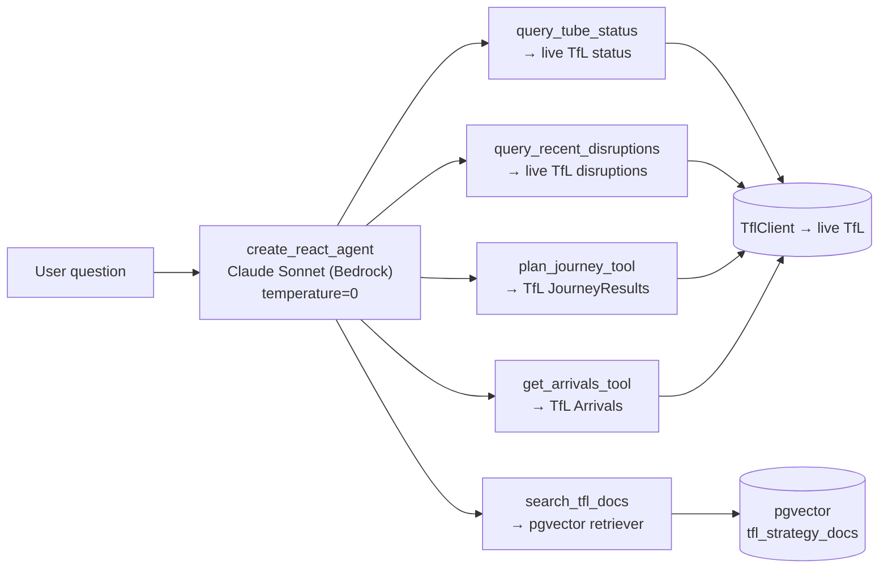
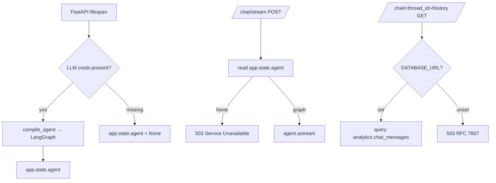

# LangGraph agent

A `create_react_agent` over **up to five typed tools** — two read TfL live, two
plan journeys / arrivals, and one is a LlamaIndex retriever over the pgvector
strategy corpus. Streaming reaches the browser via SSE.

## Code map

| Concern | Module |
|---------|--------|
| Graph compilation | `src/api/agent/graph.py` |
| Tool definitions | `src/api/agent/tools.py` |
| LlamaIndex retriever | `src/api/agent/rag.py` |
| Pydantic AI extractor | `src/api/agent/extraction.py` |
| System prompts | `src/api/agent/prompts.py` |
| SSE projection | `src/api/agent/streaming.py` |
| History read/write | `src/api/agent/history.py` |
| FastAPI routes | `src/api/main.py` (`/chat/stream`, `/chat/{thread_id}/history`) |
| Persistence DDL | `contracts/sql/004_chat.sql` |

## Tool surface



`make_tools` registers conditionally: the four TfL tools appear only when a
`TflClient` is wired (graceful degradation when `TFL_APP_KEY` is unset), and
`search_tfl_docs` appears only when a retriever is supplied. Every `TflClient`
call inside a `@tool` body is wrapped in `try/except` returning a friendly
string — LangGraph re-raises non-`ToolException` errors and would otherwise
crash the stream (ADR 010). Tool docstrings declare assumptions that should
reach the model (e.g. journey endpoints deref a hub id to its rail child).

## Pydantic AI for typed extraction

`src/api/agent/extraction.py` is the project's only Pydantic AI surface — a
cheap Haiku call that returns a validated struct (e.g. a canonical `LineId`
from free text) without spinning up the full LangGraph machinery:

```python
@lru_cache(maxsize=1)
def _normaliser() -> Agent[None, LineId]:
    return Agent(
        model=_haiku_model_string(),
        output_type=LineId,
        instructions=(
            "Extract the canonical TfL line ID from the user's question. "
            "Map informal names to slugs (e.g. 'Lizzy line' -> 'elizabeth')."
        ),
    )
```

LangGraph remains the main agent; Pydantic AI is a tool-internal helper, not a
competing framework.

## RAG retriever

```python
# src/api/agent/rag.py
retriever = build_vector_store(settings).as_retriever(similarity_top_k=4)
```

The retriever queries the LlamaIndex-managed pgvector store
(`public.tfl_strategy_docs`, 1024-dim Bedrock Titan vectors). It supports
**optional `doc_id` targeting** — if the user mentions "Annual Report", the
agent filters on that `doc_id` metadata value instead of scanning the whole
corpus. See [RAG ingestion](rag.md).

## Graceful degradation



`compile_agent` returns `None` when the LLM credentials are missing, so a deploy
without them still serves the live status views, the disruption log, and the
chat history — only `/chat/stream` 503s.

## SSE projection

LangGraph emits two stream channels — `messages` (token-level deltas) and
`updates` (tool calls + state changes). `streaming.project` collapses them into
the frame format the browser consumes. On a `plan_journey_tool` /
`get_arrivals_tool` result it emits a structured `journey` / `arrivals` frame so
the frontend can render a rich card instead of prose (ADR 011):

```text
{type: "token"   | content: "..."}        # streamed answer text
{type: "tool"    | content: "query_tube_status"}
{type: "journey" | content: <JourneyView JSON>}
{type: "arrivals"| content: <ArrivalsView JSON>}
{type: "end"     | content: "ok" | "error"}
```

The frame set is the **stable contract** between the agent runtime and the
frontend; swapping LangGraph for another framework only needs to keep it intact.

## Persistence

The user turn lands **before** the first frame so a connection drop never loses
the question; the assistant turn lands on stream end with the concatenated
tokens. The history endpoint reads `analytics.chat_messages` ordered by
`(thread_id, created_at ASC)` — the contract is documented in
`contracts/sql/004_chat.sql`.

## Tests

| Layer | Coverage |
|-------|----------|
| `agent/extraction.py` | LineId normalisation (canonical, informal, ambiguous, empty) |
| `agent/tools.py` | TfL tools — happy path, empty, parameter validation, upstream-failure swallow |
| `agent/rag.py` | retrieval, `doc_id` targeting, empty corpus, SDK failure |
| `agent/graph.py` | compile, no-creds, tool registration, model selection |
| `/chat/stream` route | happy path, 503 no graph, 503 no `DATABASE_URL`, mid-stream `end:error`, journey/arrivals frames |
| `/chat/{thread_id}/history` route | happy path, empty, RFC 7807 503 |
| Integration smokes | history round-trip + chat-stream + history-after-stream (gated on credentials) |
