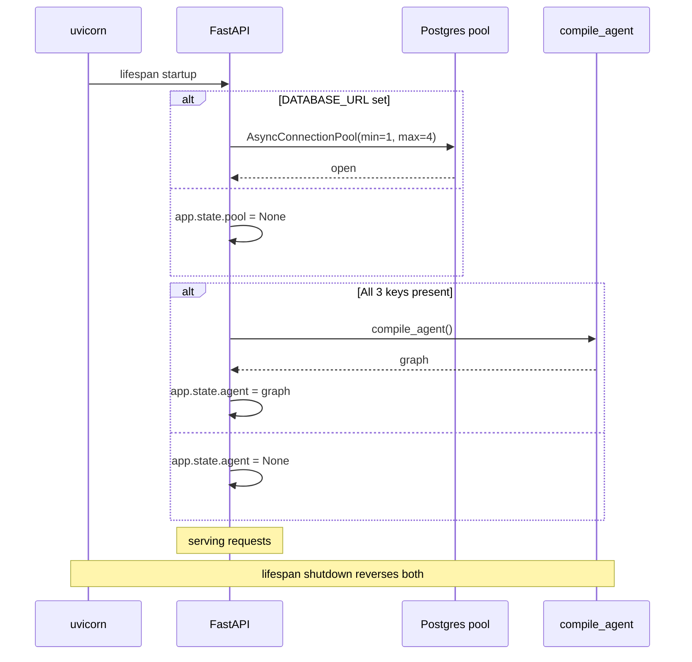
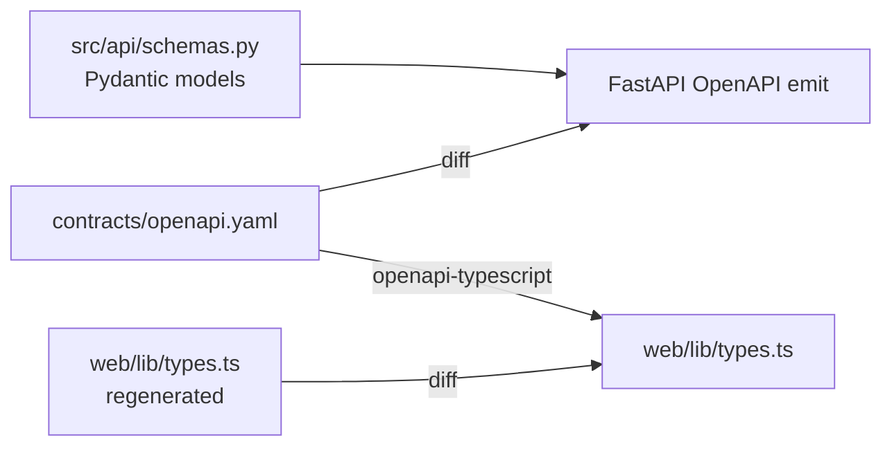

# FastAPI surface

Six endpoints, all RFC 7807 errors, a single shared async psycopg pool, and
**OpenAPI 3.1 as the contract** — the frontend regenerates types from it.

## Code map

| Concern | Module |
|---------|--------|
| Application factory + lifespan | `src/api/main.py` |
| Route handlers | `src/api/main.py` (in-line per endpoint) |
| Postgres pool + fetchers | `src/api/db.py` |
| Pydantic response models | `src/api/schemas.py` |
| Logfire wiring | `src/api/observability.py` |
| Agent compilation | `src/api/agent/` |

## Endpoints

| Method | Path | Source | Notes |
|--------|------|--------|-------|
| `GET` | `/health` | static | Liveness — returns build info |
| `GET` | `/api/v1/status/live` | `raw.line_status` | 15-min freshness window |
| `GET` | `/api/v1/status/history` | `analytics.stg_line_status` | 30-day cap, `LIMIT 10000` |
| `GET` | `/api/v1/reliability/{line_id}` | `analytics.mart_tube_reliability_daily` | Aggregate + histogram, 404 on empty window |
| `GET` | `/api/v1/disruptions/recent` | `analytics.stg_disruptions` | `?limit=50&mode=tube` |
| `GET` | `/api/v1/bus/{stop_id}/punctuality` | `analytics.stg_arrivals` | 7-day window, on-time/early/late proxy |
| `POST` | `/api/v1/chat/stream` | LangGraph agent | SSE: `{type, content}` frames |
| `GET` | `/api/v1/chat/{thread_id}/history` | `analytics.chat_messages` | Replays a thread |

## Lifespan



Each handler reads `app.state.pool` / `app.state.agent` and returns a
RFC 7807 `503` if the dependency is missing — `make check` and unit tests run
without any external services.

## Error contract

Every error response is `application/problem+json`:

```json
{
  "type": "about:blank",
  "title": "Service Unavailable",
  "status": 503,
  "detail": "DATABASE_URL not configured",
  "instance": "/api/v1/status/live"
}
```

The `_problem` helper in `src/api/main.py` wraps the four documented surfaces:

| Status | When |
|--------|------|
| 404 | `reliability` window has no rows; bus stop unknown |
| 422 | Pydantic validation failure (FastAPI default, RFC 7807-mapped) |
| 503 | Pool unset (no `DATABASE_URL`) or agent unset (missing key) |
| 502 | Bedrock / Anthropic upstream failure (mapped from `langchain_*` exceptions) |

## Pool sizing

```python
pool = AsyncConnectionPool(
    conninfo=os.environ["DATABASE_URL"],
    min_size=1,
    max_size=4,
    open=False,
)
```

Two reasons for the `max=4` ceiling:

1. The Supabase free tier caps connections strictly (~30 across all clients
   sharing the project).
2. Most queries are single-statement reads that finish in <50 ms, so a small
   pool sustains the portfolio's RPS comfortably.

## OpenAPI 3.1 as the source of truth

The committed contract lives at
[`contracts/openapi.yaml`](https://github.com/hcslomeu/tfl-monitor/blob/main/contracts/openapi.yaml)
and CI enforces a **bidirectional drift test**:

- The OpenAPI emitted by FastAPI must equal `contracts/openapi.yaml`.
- `web/lib/types.ts` regenerated from the contract must equal the committed
  `web/lib/types.ts`.



So adding a route involves three pinned files: the Pydantic schema, the
OpenAPI entry, and the TypeScript types. Drift in any direction breaks CI.

## Observability

Two instruments, configured once in `src/api/observability.py`:

```python
logfire.instrument_fastapi(app)
logfire.instrument_psycopg()
logfire.instrument_httpx()
```

Per-request spans cover route + status + latency. Per-query spans cover the
parameterised SQL + duration. LangSmith captures the agent traces — see
[Observability](../observability.md).

## Tests

| Suite | Count | Notable |
|-------|-------|---------|
| `tests/api/test_stubs.py` | parametrised | Validates that every committed route is implemented (no 501 stubs left) |
| `tests/api/test_status_live.py` | 5 | Freshness window, RFC 7807 on no pool, ordering |
| `tests/api/test_reliability.py` | 6 | Histogram shape, 404 empty window, severity ordering |
| `tests/api/test_disruptions.py` | 6 | `mode` filter via EXISTS, `limit` bounds, `last_update DESC NULLS LAST` |
| `tests/api/test_bus_punctuality.py` | 5 | Proxy math, RFC 7807 404 on empty stop |
| `tests/api/test_chat_stream.py` | 6 | SSE happy path, 503 no graph, mid-stream `end:error` |
| `tests/api/test_chat_history.py` | 3 | Order, empty, 503 |
| Integration smokes | 11 | Gated on `DATABASE_URL`, run with `-m integration` |

`tests/conftest.py::FakeAsyncPool` replaces the live psycopg pool in unit
tests — the fixture returns predictable rows without a Postgres dependency.
