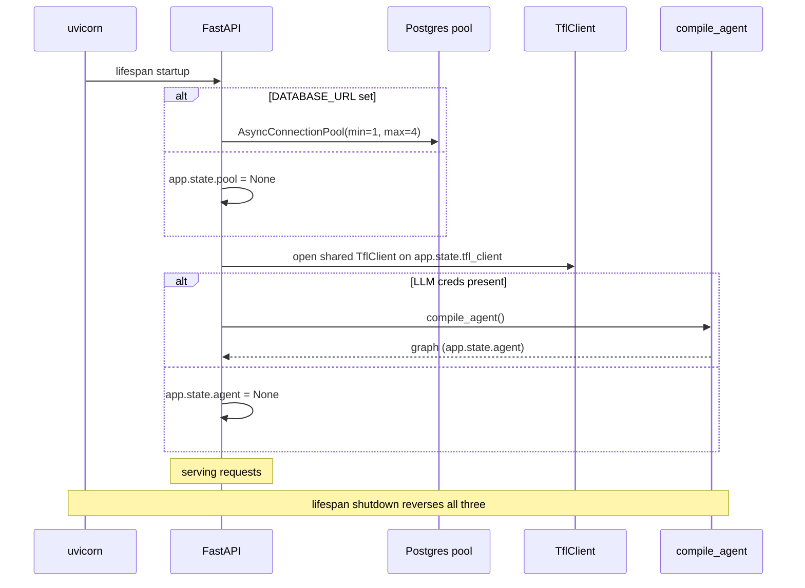
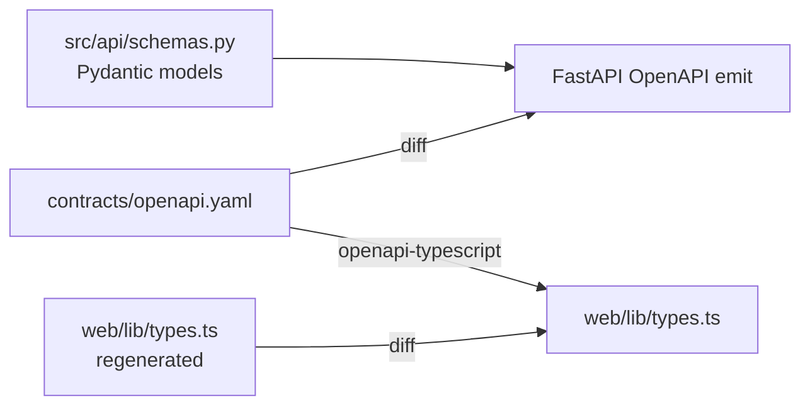

# FastAPI surface

Five endpoints, all RFC 7807 errors, a single shared async psycopg pool, and
**OpenAPI 3.1 as the contract** — the frontend regenerates types from it.

## Code map

| Concern | Module |
|---------|--------|
| Application factory + lifespan | `src/api/main.py` |
| Route handlers | `src/api/main.py` (in-line per endpoint) |
| Live TfL read-through | `src/api/live.py` |
| Postgres pool + chat/history fetchers | `src/api/db.py` |
| Station resolver | `src/api/stations.py` |
| Pydantic response models | `src/api/schemas.py` |
| Logfire wiring | `src/api/observability.py` |
| Agent compilation | `src/api/agent/` |

## Endpoints

| Method | Path | Source | Notes |
|--------|------|--------|-------|
| `GET` | `/health` | static | Liveness — returns build info |
| `GET` | `/api/v1/status/live` | live TfL `/Line/Mode/{modes}/Status` | One status row per line; `502` on upstream failure |
| `GET` | `/api/v1/disruptions/recent` | live TfL `/Line/Mode/{modes}/Status?detail=true` | `?limit=50&mode=tube`; affected stops resolved to names |
| `POST` | `/api/v1/chat/stream` | LangGraph agent | SSE: `{type, content}` frames |
| `GET` | `/api/v1/chat/{thread_id}/history` | `analytics.chat_messages` | Replays a thread |

The `/status/live` and `/disruptions/recent` handlers call `TflClient` directly
(`src/api/live.py`) — there is no database read on the request path beyond the
station-name resolver's `dim_stations` fast path. See
[Live TfL proxy](ingestion.md).

## Lifespan



Each handler reads `app.state.pool` / `app.state.tfl_client` / `app.state.agent`
and returns a problem+json error if a dependency is missing — `make check` and
unit tests run without any external services.

## Error contract

Every error response is `application/problem+json`:

```json
{
  "type": "about:blank",
  "title": "Bad Gateway",
  "status": 502,
  "detail": "Upstream TfL request failed",
  "instance": "/api/v1/status/live"
}
```

The `_problem` helper in `src/api/main.py` wraps the documented surfaces:

| Status | When |
|--------|------|
| 422 | Pydantic validation failure (FastAPI default, RFC 7807-mapped) |
| 502 | Upstream failure — TfL request error, or Bedrock / Anthropic LLM error |
| 503 | Pool unset (no `DATABASE_URL`) or agent unset (missing LLM credentials) |

## Pool sizing

```python
pool = AsyncConnectionPool(
    conninfo=os.environ["DATABASE_URL"],
    min_size=1,
    max_size=4,
    open=False,
)
```

Two reasons for the `max=4` ceiling:

1. The Supabase free tier caps connections strictly (~30 across all clients
   sharing the project).
2. The remaining DB reads — chat history and the `dim_stations` resolver fast
   path — are single-statement and finish in <50 ms, so a small pool sustains
   the portfolio's RPS comfortably.

## OpenAPI 3.1 as the source of truth

The committed contract lives at
[`contracts/openapi.yaml`](https://github.com/hcslomeu/tfl-monitor/blob/main/contracts/openapi.yaml)
and CI enforces a **bidirectional drift test**:

- The OpenAPI emitted by FastAPI must equal `contracts/openapi.yaml`.
- `web/lib/types.ts` regenerated from the contract must equal the committed
  `web/lib/types.ts`.



So adding a route involves three pinned files: the Pydantic schema, the OpenAPI
entry, and the TypeScript types. Drift in any direction breaks CI.

## Observability

Two instruments, configured once in `src/api/observability.py`:

```python
logfire.instrument_fastapi(app)
logfire.instrument_psycopg()
logfire.instrument_httpx()
```

Per-request spans cover route + status + latency; `httpx` spans cover the
outbound TfL calls (`app_key` redacted). LangSmith captures the agent traces —
see [Observability](../observability.md).

## Tests

| Suite | Notable |
|-------|---------|
| `tests/api/test_stubs.py` | Every committed route is implemented (no 501 stubs left) |
| `tests/api/` live endpoints | `status/live` + `disruptions/recent` happy path, empty modes, `502` on upstream failure |
| `tests/api/test_cors.py` | Apex pin + anchored Vercel-preview regex, attacker-origin reject |
| `tests/api/` chat | SSE happy path, 503 no graph, mid-stream `end:error`, journey/arrivals frames |
| `tests/api/` history | Order, empty, RFC 7807 503 |
| Integration smokes | Gated on `DATABASE_URL`, run with `-m integration` |

`tests/conftest.py::FakeAsyncPool` replaces the live psycopg pool in unit tests,
and `TflClient` calls are faked — no Postgres or TfL dependency in the unit
suite.
