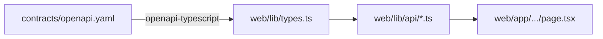

# Next.js frontend

Three views, all server components by default, types regenerated from the
OpenAPI contract. Single linter (Biome) and single test runner (Vitest + RTL).

## Code map

| Concern | Path |
|---------|------|
| App Router routes | `web/app/{page,disruptions,ask}/page.tsx` |
| Server-side fetchers | `web/lib/api/*.ts` |
| SSE parser + chat fetcher | `web/lib/sse-parser.ts`, `web/lib/api/chat-stream.ts` |
| Generated TS types | `web/lib/types.ts` (do not edit) |
| Chat UI | `web/components/chat-view.tsx` |
| shadcn primitives | `web/components/ui/*.tsx` |
| Security headers | `web/next.config.ts` |
| Tests | colocated with each module under `web/__tests__/` |

## Views

```mermaid
flowchart LR
    LANDING[/page.tsx<br/>Network Now/] -->|server fetch| SL[/api/v1/status/live]
    DISLOG[/disruptions/page.tsx<br/>Disruption Log/] -->|server fetch| DR[/api/v1/disruptions/recent]
    ASK[/ask/page.tsx<br/>ChatView/] -->|POST SSE| CHAT[/api/v1/chat/stream]

    LANDING -->|nav link| ASK
```

| View | Wired endpoint | Highlights |
|------|----------------|------------|
| **Network Now** (`/`) | `/api/v1/status/live` | Empty / error states surfaced via `Alert role="alert"`, fetcher catches `ApiError` |
| **Disruption Log** (`/disruptions`) | `/api/v1/disruptions/recent` | Per-disruption Card with category-tone badge (severe / minor / info / neutral); `closure_text` in destructive Alert |
| **Ask** (`/ask`) | `/api/v1/chat/stream` | SSE stream → token bubbles, ephemeral "Using tool …" status line |

## Type generation

```bash
make openapi-ts
```

This runs `openapi-typescript ../contracts/openapi.yaml -o lib/types.ts`
inside `web/`. CI also runs the same generation and `diff`s against the
committed file — drift fails the build.



Every fetcher imports the operation type and binds the response shape:

```ts
import type { paths } from "@/lib/types";

type LineStatus =
  paths["/api/v1/status/live"]["get"]["responses"]["200"]["content"]["application/json"][number];

export async function getStatusLive(): Promise<LineStatus[]> {
  return apiFetch<LineStatus[]>("/api/v1/status/live");
}
```

## SSE streaming

The chat view consumes a Server-Sent Events stream over `fetch` (not
`EventSource` — POST + JSON body do not fit the EventSource contract):

```ts
const response = await fetch(`${API}/api/v1/chat/stream`, {
  method: "POST",
  headers: { "content-type": "application/json", accept: "text/event-stream" },
  body: JSON.stringify({ thread_id, message }),
  signal,
});

for await (const frame of parseFrames(response.body!)) {
  switch (frame.type) {
    case "token": appendToken(frame.content); break;
    case "tool":  setToolStatus(frame.content); break;
    case "end":   if (frame.content === "error") flagErrored(); return;
  }
}
```

`parseFrames` is a stateful 60-line parser that buffers `Uint8Array` chunks
via a streaming `TextDecoder`, splits on `\n\n`, drops `:`-prefixed comments
(sse-starlette emits `: ping` periodically), and JSON-parses each `data:`
line. **Malformed JSON or unknown types are silently dropped** so a single
corrupt frame does not kill the stream.

## Security headers

`next.config.ts` registers the project-wide headers required by `CLAUDE.md`:

```ts
const headers = [
  { key: "X-Frame-Options", value: "DENY" },
  { key: "X-Content-Type-Options", value: "nosniff" },
  { key: "Referrer-Policy", value: "strict-origin-when-cross-origin" },
  { key: "Permissions-Policy", value: "camera=(), microphone=(), geolocation=()" },
];
```

## Tooling

| Concern | Tool |
|---------|------|
| Linter + formatter | Biome (sole) |
| Test runner | Vitest |
| DOM helpers | React Testing Library |
| Build | Next 16 production build |
| Package manager | `pnpm` (sole) |

```bash
pnpm --dir web install
pnpm --dir web dev          # :3000
pnpm --dir web lint
pnpm --dir web test
pnpm --dir web build
```

`make check` chains both halves of the codebase.

## Tests

54 web tests covering:

- **SSE parser** — single frame, multi-frame chunk, partial chunk buffering,
  `:`-comment skip, unknown-type drop, malformed-JSON survival.
- **Fetchers** — URL/headers/body assertions, RFC 7807 `detail` surfacing,
  network `TypeError` propagation, multi-chunk reader buffering.
- **Network Now page** — happy path, empty array, `ApiError` alert,
  non-`ApiError` rejection fallback.
- **Disruption Log page** — list rendering, category-tone mapping, closure
  callout shown/hidden, affected-routes list, error fallback.
- **ChatView** — empty shell, streaming tokens, tool-status lifecycle,
  503 alert + conversation rollback, mid-stream `end:error` flagging.

`web/__tests__/setup.ts` initialises `jsdom` and stubs `fetch` per test via
`vi.stubGlobal`.
