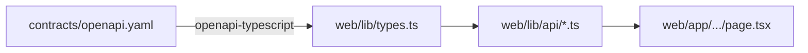

# Next.js frontend

A single-page dashboard + chat, all server components by default, types
regenerated from the OpenAPI contract. Single linter (Biome) and single test
runner (Vitest + RTL).

## Code map

| Concern | Path |
|---------|------|
| App Router route | `web/app/page.tsx` (one-pager; legacy `/disruptions`, `/ask` 308-redirect to `/`) |
| Server-side fetchers | `web/lib/api/*.ts` |
| SSE parser + chat fetcher | `web/lib/sse-parser.ts`, `web/lib/api/chat-stream.ts` |
| Generated TS types | `web/lib/types.ts` (do not edit) |
| Dashboard + chat UI | `web/components/dashboard/*.tsx` (cards, `chat-panel.tsx`, journey/arrivals cards) |
| shadcn primitives | `web/components/ui/*.tsx` |
| Security headers | `web/next.config.ts` |
| Tests | colocated with each module under `web/__tests__/` |

## One-pager dashboard

The four routes collapsed into a single page (TM-E5): live status, disruptions,
and chat sit side by side, with the legacy paths kept alive via 308 redirects.

```mermaid
flowchart LR
    PAGE[/page.tsx<br/>dashboard one-pager/]
    PAGE -->|poll 30s| SL[/api/v1/status/live]
    PAGE -->|poll 5min| DR[/api/v1/disruptions/recent]
    PAGE -->|POST SSE| CHAT[/api/v1/chat/stream]
```

| Surface | Wired endpoint | Highlights |
|---------|----------------|------------|
| Network status + pulse | `/api/v1/status/live` | Mode tabs, severe/degraded/good tally; empty / error via `Alert role="alert"` |
| Happening now / coming up / news | `/api/v1/disruptions/recent` | Category-tone cards; `closure_text` callout; resolved station names |
| Chat panel | `/api/v1/chat/stream` | SSE → token bubbles, ephemeral "Using tool …" line, journey / arrivals cards (ADR 011) |

## Type generation

```bash
make openapi-ts
```

This runs `openapi-typescript ../contracts/openapi.yaml -o lib/types.ts`
inside `web/`. CI also runs the same generation and `diff`s against the
committed file — drift fails the build.



Every fetcher imports the operation type and binds the response shape:

```ts
import type { paths } from "@/lib/types";

type LineStatus =
  paths["/api/v1/status/live"]["get"]["responses"]["200"]["content"]["application/json"][number];

export async function getStatusLive(): Promise<LineStatus[]> {
  return apiFetch<LineStatus[]>("/api/v1/status/live");
}
```

## SSE streaming

The chat view consumes a Server-Sent Events stream over `fetch` (not
`EventSource` — POST + JSON body do not fit the EventSource contract):

```ts
const response = await fetch(`${API}/api/v1/chat/stream`, {
  method: "POST",
  headers: { "content-type": "application/json", accept: "text/event-stream" },
  body: JSON.stringify({ thread_id, message }),
  signal,
});

for await (const frame of parseFrames(response.body!)) {
  switch (frame.type) {
    case "token": appendToken(frame.content); break;
    case "tool":  setToolStatus(frame.content); break;
    case "end":   if (frame.content === "error") flagErrored(); return;
  }
}
```

`parseFrames` is a stateful 60-line parser that buffers `Uint8Array` chunks
via a streaming `TextDecoder`, splits on `\n\n`, drops `:`-prefixed comments
(sse-starlette emits `: ping` periodically), and JSON-parses each `data:`
line. **Malformed JSON or unknown types are silently dropped** so a single
corrupt frame does not kill the stream.

## Security headers

`next.config.ts` registers the project-wide headers required by `CLAUDE.md`:

```ts
const headers = [
  { key: "X-Frame-Options", value: "DENY" },
  { key: "X-Content-Type-Options", value: "nosniff" },
  { key: "Referrer-Policy", value: "strict-origin-when-cross-origin" },
  { key: "Permissions-Policy", value: "camera=(), microphone=(), geolocation=()" },
];
```

## Tooling

| Concern | Tool |
|---------|------|
| Linter + formatter | Biome (sole) |
| Test runner | Vitest |
| DOM helpers | React Testing Library |
| Build | Next 16 production build |
| Package manager | `pnpm` (sole) |

```bash
pnpm --dir web install
pnpm --dir web dev          # :3000
pnpm --dir web lint
pnpm --dir web test
pnpm --dir web build
```

`make check` chains both halves of the codebase.

## Tests

The Vitest + RTL suite covers:

- **SSE parser** — single frame, multi-frame chunk, partial chunk buffering,
  `:`-comment skip, unknown-type drop, malformed-JSON survival.
- **Fetchers** — URL/headers/body assertions, RFC 7807 `detail` surfacing,
  network `TypeError` propagation, multi-chunk reader buffering.
- **Dashboard surfaces** — status cards + network pulse, happening-now / coming-up
  / news derivations, category-tone mapping, closure callout shown/hidden,
  resolved station names, empty + error fallbacks.
- **Chat panel** — empty shell, streaming tokens, tool-status lifecycle,
  503 alert + conversation rollback, mid-stream `end:error` flagging,
  journey / arrivals card rendering.

`web/__tests__/setup.ts` initialises `jsdom` and stubs `fetch` per test via
`vi.stubGlobal`.
