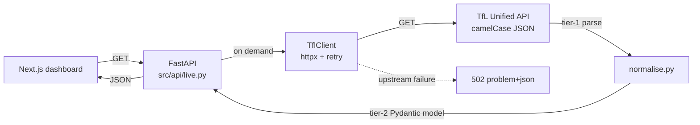
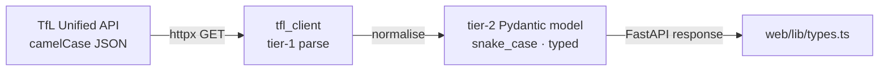

# Live TfL proxy

The app reads through to the **TfL Unified API on demand** — there is no broker
and no feed warehouse (ADR 014). A request to `/status/live` or
`/disruptions/recent` triggers an async HTTP call to TfL, normalises the
response with Pydantic v2, and returns it. Nothing is persisted; the disk-full
class of incident that bricked the warehouse three times is structurally gone.

## Code map

| Concern | Module |
|---------|--------|
| Async HTTP client to TfL | `src/ingestion/tfl_client/client.py` |
| Hand-rolled retry (429 / 5xx / timeout) | `src/ingestion/tfl_client/retry.py` |
| Tier-1 → tier-2 normalisation | `src/ingestion/tfl_client/normalise.py` |
| Read-through endpoint handlers | `src/api/live.py` |
| NaPTAN → station-name resolver | `src/api/stations.py` |
| Logfire wiring | `src/api/observability.py` |

## Read-through flow

| Endpoint | TfL call | Notes |
|----------|----------|-------|
| `GET /api/v1/status/live` | `/Line/Mode/{modes}/Status` | One status row per line |
| `GET /api/v1/disruptions/recent` | `/Line/Mode/{modes}/Status?detail=true` | Walks `Line → lineStatuses[] → disruption` |

`?detail=true` is deliberate: the free-tier `/Disruption` endpoint returns empty
`affectedRoutes` / `affectedStops`, whereas the detailed status response carries
the populated fan-out (ADR 007). When TfL fails or times out, the handler
returns RFC 7807 `502` rather than a stale or empty body.

## Contracts

Tier-1 = the wire format from TfL — messy, optional-heavy, evolves at TfL's
pace (`contracts/schemas/tfl_api.py`). Tier-2 = the flat, typed shape the API
returns, pinned by `contracts/openapi.yaml`. The normalisation step lives in
`tfl_client/normalise.py`; synthetic SHA-256 IDs anchor disruptions whose
upstream payload omits a stable identifier.

## Resilience

`TflClient` wraps every call in a hand-rolled retry policy:

- **429** — honour `Retry-After`, exponential backoff.
- **5xx / timeout** — bounded retries, then surface the failure as `502`.
- **`app_key` redaction** — the TfL key is stripped before any Logfire span is
  emitted (`src/api/observability.py`).

Inside the agent, every `TflClient` call in a `@tool` body is additionally
wrapped in `try/except` returning a friendly string — LangGraph re-raises
non-`ToolException` errors and would otherwise crash the chat stream (ADR 010).

## Station resolution

`src/api/stations.py` turns the NaPTAN codes in a disruption payload into
human-readable station names. The fast path queries the `analytics.dim_stations`
mart (built from the `tfl_stations` seed); a miss falls back to a live TfL
`/StopPoint/{naptan_id}` lookup, with a process-lifetime cache that only stores
confirmed results so a transient TfL hiccup never poisons the dictionary.

## Tests

| Layer | Coverage |
|-------|----------|
| `tfl_client/retry.py` | retry on 429, retry on 5xx, retry on timeout, `app_key` redaction |
| `tfl_client/normalise.py` | tier-1 → tier-2 mapping, synthetic-ID stability |
| `src/api/live.py` | happy path, empty modes, `502` on upstream failure |
| `src/api/stations.py` | mart fast path, live fallback, confirmed-404 cache, no cache-poison on 5xx |

All fixtures live under `tests/fixtures/tfl/` — production code never hits the
live TfL API in tests.
