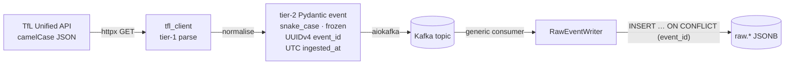
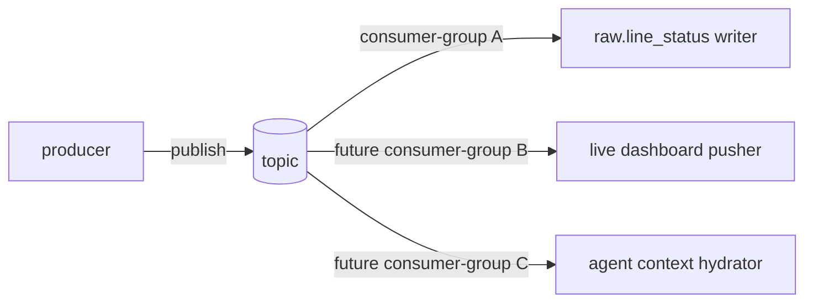

# Streaming ingestion

The ingestion layer turns four polling endpoints on the TfL Unified API into
three Kafka topics and three Postgres `raw.*` tables. Every byte that crosses
a service boundary is a Pydantic v2 model.

## Code map

| Concern | Module |
|---------|--------|
| Async HTTP client to TfL | `src/ingestion/tfl_client/` |
| Producers | `src/ingestion/producers/{line_status,arrivals,disruptions}.py` |
| Consumers | `src/ingestion/consumers/{line_status,arrivals,disruptions}.py` |
| Generic consumer + writer | `src/ingestion/consumers/_base.py` |
| Logfire wiring | `src/ingestion/observability.py` |

## Contracts



Tier-1 = the wire format from TfL — messy, optional-heavy, evolves at TfL's
pace. Tier-2 = our internal wire format — flat, frozen, every consumer reads
one shape.

The normalisation tier-1 → tier-2 is a single-purpose step inside
`tfl_client/normalise.py`. Synthetic SHA-256 IDs anchor disruptions whose
upstream payload omits a stable identifier.

## Producers

Three async daemons, one shape:

```python
class LineStatusProducer:
    POLL_INTERVAL_SECONDS = 30

    async def run_forever(self) -> None:
        async for ts in clock_ticks(self.POLL_INTERVAL_SECONDS):
            payload = await self._client.fetch_line_status()
            event = normalise_line_status(payload, ingested_at=ts)
            await self._producer.send(event, key=event.line_id)
```

| Producer | Cadence | Partition key | `event_type` |
|----------|---------|---------------|--------------|
| `LineStatusProducer` | 30 s | `line_id` | `line-status.snapshot` |
| `ArrivalsProducer` (×5 NaPTAN hubs in one process) | 30 s | `station_id` | `arrivals.snapshot` |
| `DisruptionsProducer` (×4 modes) | 300 s | `disruption_id` | `disruptions.snapshot` |

Producers are idempotent at the broker level: `acks="all"`, `enable_idempotence=true`,
UUIDv4 `event_id`. A retry never duplicates a row downstream.

## Kafka choice (and why we exploit it)



Three properties earn Kafka its place:

1. **Decoupling** — producer keeps polling while a consumer redeploys.
2. **Replay** — rewinding a topic re-hydrates the warehouse without
   re-polling.
3. **Fan-out** — the same `arrivals` topic feeds both
   `mart_bus_metrics_daily` and any future stream consumer.

A cron-to-Postgres pipeline would deliver the same rows. It would also lose
all three properties on day one.

## Consumers

`RawEventConsumer[E]` is generic over the event type; `RawEventWriter(table)`
writes JSONB rows. The `line-status` consumer became the parametric template
for arrivals + disruptions in TM-B4 — same code path, different topic.

```python
async def consume_one(self, msg: ConsumerRecord) -> None:
    event = self._codec.decode(msg.value)
    try:
        await self._writer.write(event)
    except OperationalError:
        await self._writer.reconnect()
        raise   # let the consumer retry the offset
    await self._consumer.commit({tp: msg.offset + 1})
```

### Failure isolation

| Failure | Handling | Trace |
|---------|----------|-------|
| Poison pill (decode error) | skip + commit | `kafka.consume.skip` |
| Transient DB error (`OperationalError`) | reconnect + replay offset | `psycopg.reconnect` |
| Unknown exception | log + replay offset | `kafka.consume.error` |

Idempotency comes from `INSERT … ON CONFLICT (event_id) DO NOTHING` — a replay
of a successful offset is a no-op at the row level.

### Lag observability

Lag is computed on every `kafka.consume` span and refreshed every
**50 messages or 30 s** (whichever comes first), so a slow partition cannot
hide behind a fast one.

## Tests

| Layer | Coverage |
|-------|----------|
| Unit (per producer) | retry on 429, retry on 5xx, retry on timeout, `app_key` redaction, payload normalisation |
| Unit (per consumer) | poison pill, transient DB, replay-on-error, lag bookkeeping, namespace override |
| Integration smoke | Producer round-trip with embedded Redpanda + Postgres (gated on `DATABASE_URL` + `KAFKA_BOOTSTRAP_SERVERS`) |

Total: ~70 unit tests + 4 integration smokes across the three topics. All
fixtures live under `tests/fixtures/tfl/` — production code never hits the
live TfL API in tests.
