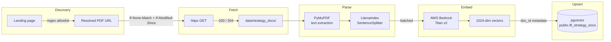

# RAG ingestion

Three TfL strategy documents are fetched, parsed, embedded, and upserted into a
**pgvector** table. The pipeline is **conditional** (only re-downloads what
changed) and **idempotent** (re-running upserts the same chunks).

## Documents indexed

| Doc ID | Title | Landing page |
|--------|-------|--------------|
| `tfl_business_plan` | TfL Business Plan | https://tfl.gov.uk/corporate/publications-and-reports/business-plan |
| `mts_2018` | Mayor's Transport Strategy 2018 | https://www.london.gov.uk/programmes-strategies/transport/our-vision-transport/mayors-transport-strategy-2018 |
| `tfl_annual_report` | TfL Annual Report and Statement of Accounts | https://tfl.gov.uk/corporate/publications-and-reports/annual-report |

The landing pages are the citation surface; the resolved CDN URLs are not,
because TfL roll the URL stem yearly (`business-plan-2026` → `2027`).

## Pipeline



PyMuPDF replaced Docling (ADR 013) — text extraction is fast and CPU-light, so
the parse no longer OOMs the shared 2 GB box. Bedrock Titan v2 replaced OpenAI
embeddings, and pgvector replaced Pinecone, in the TM-32 cutover.

## Idempotency strategy

| Stage | Mechanism | Why |
|-------|-----------|-----|
| Fetch | `If-None-Match` + `If-Modified-Since` from the sources-state cache | TfL serves 304 unless the PDF changed |
| Parse | Pure function of bytes → no caching needed | PyMuPDF output is deterministic |
| Embed | Bedrock `InvokeModel`, batched per request | 1024-dim Titan vectors |
| Upsert | Stable id keyed on `doc_id` + chunk index | Re-upsert produces the same rows |
| Rollover | Delete the doc's rows before re-ingest | New URL stem ⇒ wipe stale chunks cleanly |

## CLI

```bash
# Default — only refetch what changed
uv run python -m rag.ingest

# Re-scrape each landing page and rewrite resolved URLs
uv run python -m rag.ingest --refresh-urls

# Bypass ETag cache and re-download every PDF
uv run python -m rag.ingest --force-refetch

# Run fetch + parse only; skip embedding and the pgvector upsert (sizing dry-run)
uv run python -m rag.ingest --dry-run
```

If one of the three documents fails its fetch / parse / embed / upsert cycle,
the others still complete and the CLI exits non-zero so the failure surfaces
rather than being swallowed.

!!! note "Run off-box"
    Ingest runs on a workstation (or a throwaway larger instance), never the
    shared 2 GB Lightsail box, pointed at the same Supabase pgvector DSN +
    Bedrock region. There is **no scheduler** — Airflow was removed (ADR 008)
    and the corpus changes a few times a year, so ingest is a manual run.

## pgvector store shape

| Property | Value |
|----------|-------|
| Table | `public.tfl_strategy_docs` |
| Dimension | 1024 |
| Embedding model | `amazon.titan-embed-text-v2:0` (Bedrock, `eu-west-2`) |
| Metric | cosine |
| Metadata fields | `doc_id`, `chunk_index`, `page`, `text` |

`build_vector_store` (`src/rag/vectorstore.py`) is the single LlamaIndex
`PGVectorStore` factory shared by ingest (write) and the agent retriever (read),
so both sides speak the same table and embedding. The agent filters on `doc_id`
for per-document targeting — see [LangGraph agent](agent.md).

## Cost

A full re-embedding of all three PDFs is a one-time, sub-pound Bedrock spend.
**Conditional GETs and stable ids mean steady-state runs incur near-zero
embedding cost** — most runs return 304 for every doc and exit in under a
second.

## Tests

30 unit tests with fakes for httpx / PyMuPDF / Bedrock / pgvector:

| Module | Coverage |
|--------|----------|
| `sources.py` | landing-page resolver picks the right PDF URL via per-source allowlist |
| `fetch.py` | 304 short-circuit, 200 with body, ETag round-trip, retry on 5xx |
| `parse.py` | PyMuPDF text → chunks with stable text + page metadata; default extractor is PyMuPDF |
| `embeddings.py` | Titan `InvokeModel` body shape, 1024-dim vector, error path |
| `upsert.py` | Id stability, doc rollover, partial-failure handling |
| `ingest.py` | Orchestrator argument parsing, exit-non-zero on partial failure |

A separate integration test drives `build_vector_store` against a real pgvector
so the dialect / ORM / `SET`-param class of bug can't regress past the fakes.
No live network is hit in the unit suite — fakes ride alongside the production
clients via constructor injection.
