# RAG ingestion

Three TfL strategy documents are fetched, parsed, embedded, and upserted into
Pinecone. The pipeline is **conditional** (only re-downloads what changed) and
**idempotent** (re-running upserts the same row IDs).

## Documents indexed

| Doc ID | Title | Landing page |
|--------|-------|--------------|
| `tfl_business_plan` | TfL Business Plan | https://tfl.gov.uk/corporate/publications-and-reports/business-plan |
| `mts_2018` | Mayor's Transport Strategy 2018 | https://www.london.gov.uk/programmes-strategies/transport/our-vision-transport/mayors-transport-strategy-2018 |
| `tfl_annual_report` | TfL Annual Report and Statement of Accounts | https://tfl.gov.uk/corporate/publications-and-reports/annual-report |

The landing pages are the citation surface; the resolved CDN URLs are not
because TfL roll the URL stem yearly (`business-plan-2026` → `2027`).

## Pipeline

```mermaid
flowchart LR
    subgraph DISCOVER[Discovery]
      L[Landing page] -->|regex allowlist| URL[Resolved PDF URL]
    end

    subgraph FETCH[Fetch]
      URL -->|If-None-Match + If-Modified-Since| HTTP[httpx GET]
      HTTP -->|200| LOCAL[data/strategy_docs/]
      HTTP -->|304| LOCAL
    end

    subgraph PARSE[Parse]
      LOCAL --> DOC[Docling DocumentConverter]
      DOC --> CHUNK[HybridChunker<br/>section + table aware]
    end

    subgraph EMBED[Embed]
      CHUNK -->|"100 chunks/req"| OAI[OpenAI<br/>text-embedding-3-small]
      OAI -->|retry on 429| VEC[1536-dim vectors]
    end

    subgraph UPSERT[Upsert]
      VEC -->|sha256 id| PC[Pinecone<br/>tfl-strategy-docs]
      PC -->|namespace per doc_id| NS[(tfl_business_plan<br/>mts_2018<br/>tfl_annual_report)]
    end
```



## Idempotency strategy

| Stage | Mechanism | Why |
|-------|-----------|-----|
| Fetch | `If-None-Match` + `If-Modified-Since` from `data/cache/sources_state.json` | TfL serves 304 unless the PDF changed |
| Parse | Pure function of bytes → no caching needed | Docling output is deterministic |
| Embed | OpenAI batch endpoint with retry on 429 | Async-batches 100 chunks per request |
| Upsert | Stable id `sha256("{resolved_url}::{chunk_index}")` | Re-upsert produces the same vector ids |
| Rollover | Delete-namespace before re-ingest | New URL stem ⇒ wipe stale vectors cleanly |

## CLI

```bash
# Default — only refetch what changed
uv run python -m rag.ingest

# Re-scrape each landing page and rewrite resolved URLs
uv run python -m rag.ingest --refresh-urls

# Bypass ETag cache and re-download every PDF
uv run python -m rag.ingest --force-refetch

# Run fetch + parse + embed; skip Pinecone upsert (sizing dry-run)
uv run python -m rag.ingest --dry-run
```

If 1 of 3 documents fails its fetch / parse / embed / upsert cycle, the
others still complete and the CLI exits non-zero so any future cron / GitHub
Action surfaces the failure instead of swallowing it.

A weekly Airflow DAG (`airflow/dags/rag_ingest_weekly.py`) re-runs the
pipeline at `0 3 * * 1`.

## Cost

A full re-embedding of all three PDFs runs at well under £0.20 one-time at
the current `text-embedding-3-small` price ($0.02 per 1M tokens).
**Conditional GETs and stable Pinecone IDs mean steady-state runs incur
near-zero embedding spend** — most weeks every doc returns 304 and the
pipeline exits in under a second.

## Pinecone index shape

| Property | Value |
|----------|-------|
| Index name | `tfl-strategy-docs` |
| Dimension | 1536 |
| Metric | cosine |
| Cloud | AWS, `us-east-1` (serverless) |
| Namespaces | `tfl_business_plan`, `mts_2018`, `tfl_annual_report` |
| Metadata fields | `doc_id`, `chunk_index`, `page`, `text` |

The agent fans out across all three namespaces by default with optional
`doc_id` targeting — see [LangGraph agent](agent.md).

## Tests

28 unit tests with fakes for httpx / Docling / OpenAI / Pinecone:

| Module | Coverage |
|--------|----------|
| `sources.py` | landing-page resolver picks the right PDF URL via per-source allowlist |
| `fetch.py` | 304 short-circuit, 200 with body, ETag round-trip, retry on 5xx |
| `parse.py` | Docling output → chunks with stable text + page metadata |
| `embed.py` | Batch sizing, retry on 429, async ordering preserved |
| `upsert.py` | Id stability, namespace rollover, partial-failure handling |
| `ingest.py` | Orchestrator argument parsing, exit-non-zero on partial failure |

No live network is hit in unit tests — fakes ride alongside production
clients via constructor injection.
