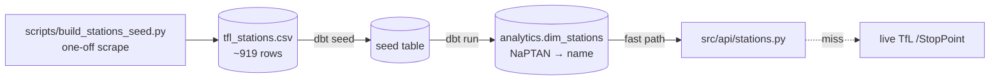

# Reference data (dbt)

ADR 014 removed the feed warehouse — the `raw.*` landing tables, the staging
models, and the reliability / bus / disruptions marts are all gone. What
remains is a **small, static reference layer**: a station seed and one mart
built from it. Nothing here grows with feed volume.

## What dbt builds now

| Object | Type | Source of truth |
|--------|------|-----------------|
| `tfl_stations` | dbt **seed** (`dbt/seeds/tfl_stations.csv`) | `scripts/build_stations_seed.py` (one-off, from `/StopPoint/Mode/{mode}`) |
| `analytics.dim_stations` | dbt **model** (`dbt/models/marts/dim_stations.sql`) | the seed above |



`dim_stations` is the fast path for the NaPTAN → station-name resolver
(`src/api/stations.py`). It is static, so it is built **once per deploy** rather
than on a schedule.

## How it runs

There is no orchestrator. Apache Airflow was removed (ADR 008), and ADR 014
removed the recurring dbt + retention cron. `scripts/deploy.sh` runs a one-shot
`dbt seed` + `dbt build` of `dim_stations` after the API container passes its
health check (`scripts/cron-dbt-run.sh`). The build is **non-fatal**: if it
fails, the app still serves live data and the resolver falls back to the live
TfL `/StopPoint` lookup.

```bash
# Manual rebuild on the box (what the deploy step calls):
ssh ubuntu@13.41.145.33 '/opt/tfl-monitor/scripts/cron-dbt-run.sh'
```

## Why keep dbt at all

For one seed and one model, raw SQL would also work. dbt earns its place
because it ships **tests, lineage, and documentation** with the data for
near-zero cost, and because regenerating the station reference from scratch is a
single `dbt build` against any fresh Postgres — useful given the database has
been recreated from empty more than once.

## The rest of the database

Everything else in Postgres is application state, not a dbt artifact:

| Object | Purpose |
|--------|---------|
| pgvector store (`public.tfl_strategy_docs`) | RAG retrieval — see [RAG ingestion](rag.md) |
| `analytics.chat_messages` | chat memory backing `/chat/{thread_id}/history` |
| `ref.lines`, `ref.stations` | line / station lookup seeds |

## Tests

`uv run task dbt-parse` gates the project on every PR. The `dim_stations` model
and the `tfl_stations` seed carry generic dbt tests (`unique`, `not_null` on the
NaPTAN key) under `dbt/models/marts/schema.yml` and `dbt/seeds/schema.yml`.
