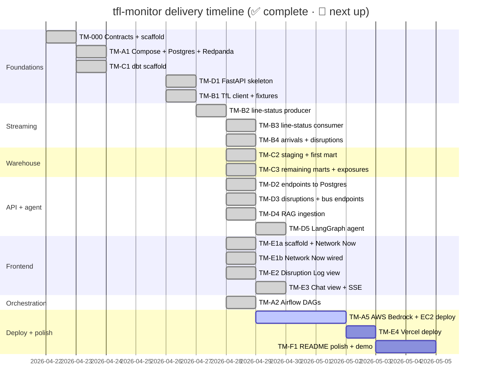

# Roadmap

The project is built as **work packages** (WPs), grouped into parallel tracks
so at most two agents can collide-free at any time.

## Track structure

| Track | Owner directories | Purpose |
|-------|------------------|---------|
| **A — infra** | `docker-compose.yml`, `infra/`, `airflow/`, `.github/` | Boots, deploys, schedules |
| **B — ingestion** | `src/ingestion/` | Producers + consumers + tfl-client |
| **C — dbt** | `dbt/` | Staging, marts, exposures, tests |
| **D — api-agent** | `src/api/`, `src/agent/`, `src/rag/` | FastAPI + LangGraph + RAG |
| **E — frontend** | `web/` | Next.js dashboard |
| **F — polish** | top-level docs, `README.md` | Demo, video, polish |

## Status

## WP ledger

Source of truth: [`PROGRESS.md`](https://github.com/hcslomeu/tfl-monitor/blob/main/PROGRESS.md).

| Phase | WP | Title | Track | Status |
|-------|----|-------|-------|--------|
| 0 | TM-000 | Contracts + scaffold | — | ✅ 2026-04-22 |
| 1 | TM-A1 | Docker Compose + Postgres + Redpanda + Airflow | A | ✅ 2026-04-23 |
| 1 | TM-B1 | Async TfL client + fixtures | B | ✅ 2026-04-26 |
| 2 | TM-C1 | dbt scaffold | C | ✅ 2026-04-23 |
| 2 | TM-D1 | FastAPI skeleton + Logfire wiring | D | ✅ 2026-04-26 |
| 3 | TM-B2 | line-status producer | B | ✅ 2026-04-27 |
| 3 | TM-B3 | line-status consumer | B | ✅ 2026-04-28 |
| 3 | TM-C2 | dbt staging + first mart | C | ✅ 2026-04-28 |
| 3 | TM-D2 | Wire endpoints to Postgres | D | ✅ 2026-04-28 |
| 3 | TM-E1a | Next.js scaffold + Network Now (mocked) | E | ✅ 2026-04-28 |
| 3 | TM-E1b | Network Now wired to `/status/live` | E | ✅ 2026-04-28 |
| 4 | TM-B4 | arrivals + disruptions topics | B | ✅ 2026-04-28 |
| 4 | TM-C3 | Remaining marts + tests + exposures | C | ✅ 2026-04-28 |
| 4 | TM-D3 | Remaining endpoints | D | ✅ 2026-04-28 |
| 4 | TM-E2 | Disruption Log view | E | ✅ 2026-04-28 |
| 5 | TM-A2 | Airflow DAGs | A | ✅ 2026-04-28 |
| 5 | TM-D4 | RAG ingestion: Docling → Pinecone | D | ✅ 2026-04-28 |
| 6 | TM-D5 | LangGraph agent (SQL + RAG + Pydantic AI) | D | ✅ 2026-04-29 |
| 6 | TM-E3 | Chat view with SSE | E | ✅ 2026-04-29 |
| 7 | TM-A3 | Supabase provisioning | A | 🚧 absorbed into TM-A5 |
| 7 | TM-A4 | Redpanda Cloud | A | 🚧 absorbed into TM-A5 |
| 7 | TM-A5 | AWS Bedrock + EC2 deploy | A | 🚧 in progress |
| 7 | TM-E4 | Vercel deploy | E | ⬜ |
| 7 | TM-F1 | README polish + demo video + live URL | F | ⬜ |

## What "in progress" means

A WP is *in progress* once its plan in `.claude/specs/TM-XXX-plan.md` has
been signed off by the author and Phase 3 (implementation) has started. The
[TM-A5 plan](https://github.com/hcslomeu/tfl-monitor/blob/main/.claude/specs/TM-A5-plan.md)
is the latest active document.

## How a WP closes

Every WP runs through this checklist before being marked `✅`:

- [x] All acceptance criteria from the spec met
- [x] `uv run task lint` (Ruff + Mypy strict) passes
- [x] `uv run task test` (Pytest, no integration / no airflow markers) passes
- [x] `uv run task dbt-parse` passes if `dbt/` or `contracts/sql/` was touched
- [x] `make check` (Python + TS gates chained) passes end-to-end
- [x] `PROGRESS.md` updated with completion date and notes
- [x] Linear issue moved to `Done`
- [x] PR opened, referencing the Linear issue, body in English
