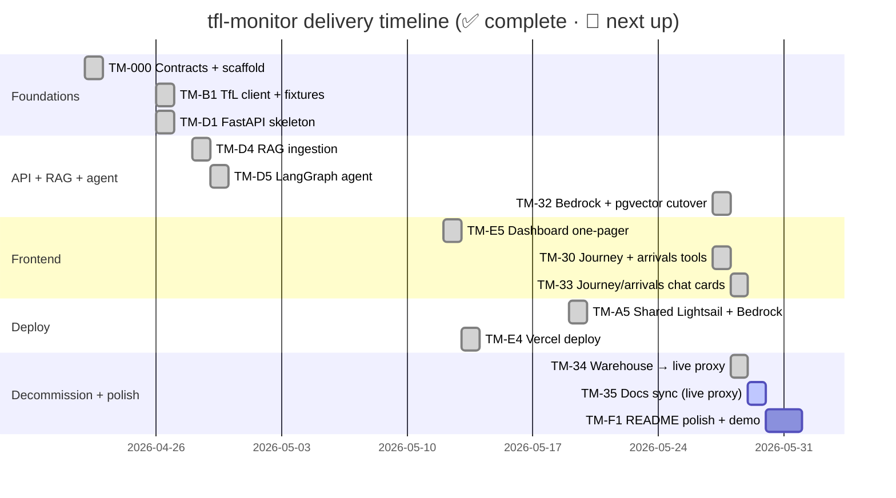

# Roadmap

The project is built as **work packages** (WPs), grouped into parallel tracks
so at most two agents can collide-free at any time.

## Track structure

| Track | Owner directories | Purpose |
|-------|------------------|---------|
| **A — infra** | `infra/`, `scripts/`, `.github/` | Boots, deploys (shared Lightsail) |
| **B — ingestion** | `src/ingestion/tfl_client/` | Async TfL client (read-through) |
| **C — dbt** | `dbt/` | Station seed + `dim_stations` |
| **D — api-agent** | `src/api/`, `src/rag/` | FastAPI + LangGraph + RAG |
| **E — frontend** | `web/` | Next.js dashboard |
| **F — polish** | top-level docs, `README.md` | Demo, video, polish |

## Status

## WP ledger

Source of truth: [`PROGRESS.md`](https://github.com/hcslomeu/tfl-monitor/blob/main/PROGRESS.md).
The highlights below track the live-proxy shape; the full per-WP notes live in
`PROGRESS.md`.

| Phase | WP | Title | Status |
|-------|----|-------|--------|
| 0 | TM-000 | Contracts + scaffold | ✅ |
| 1 | TM-B1 | Async TfL client + fixtures | ✅ |
| 2 | TM-D1 | FastAPI skeleton + Logfire | ✅ |
| 5 | TM-D4 | RAG ingestion (later migrated to PyMuPDF + Bedrock + pgvector) | ✅ |
| 6 | TM-D5 | LangGraph agent (SQL + RAG + Pydantic AI) | ✅ |
| 7 | TM-E5 | Dashboard one-pager + chat | ✅ |
| 7 | TM-A5 | Shared Lightsail + Bedrock deploy | ✅ |
| 7 | TM-E4 | Vercel deploy | ✅ |
| 7 | TM-29 | Station resolver + disruption enrichment | ✅ |
| 7 | TM-30 | Journey + arrivals agent tools | ✅ |
| 7 | TM-32 | RAG migration: Bedrock + pgvector | ✅ |
| 7 | TM-33 | Journey/arrivals chat cards (SSE frames) | ✅ |
| 7 | TM-34 | Decommission warehouse → live TfL proxy + RAG | ✅ |
| 7 | TM-35 | Docs sync — mkdocs to live-proxy architecture | 🚧 |
| 7 | TM-F1 | README polish + demo video + live URL | ⬜ |

!!! note "Superseded WPs"
    Earlier streaming + warehouse WPs (line-status / arrivals / disruptions
    producers + consumers, the `raw.*` → staging → marts dbt models, and the
    reliability / bus endpoints) shipped and were later **removed by ADR 014**.
    The Airflow DAGs (TM-A2) were removed by ADR 008, and Docling/OpenAI/Pinecone
    (TM-D4) were replaced in TM-32. They remain in git history.

## How a WP closes

Every WP runs through this checklist before being marked `✅`:

- [x] All acceptance criteria from the spec met
- [x] `uv run task lint` (Ruff + Mypy strict) passes
- [x] `uv run task test` (Pytest) passes
- [x] `uv run task dbt-parse` passes if `dbt/` or `contracts/sql/` was touched
- [x] `make check` (Python + TS gates chained) passes end-to-end
- [x] `PROGRESS.md` updated with completion date and notes
- [x] Linear issue moved to `Done`
- [x] PR opened, referencing the Linear issue, body in English
