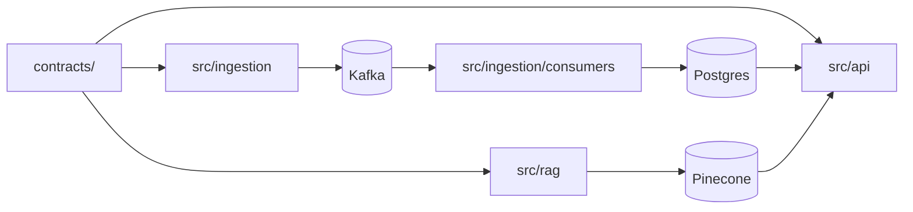

# src/

Python source — four packages, one wheel target. Every cross-package import
flows through `contracts/`; nothing in `src/` defines its own DTOs.

## Packages

| Path | Track | Purpose |
|------|-------|---------|
| [`api/`](./api) | D-api-agent | FastAPI app, route handlers, async psycopg pool, LangGraph agent |
| [`agent/`](./agent) | D-api-agent | Legacy graph (kept for parity until TM-A5 collapses it) |
| [`ingestion/`](./ingestion) | B-ingestion | Async TfL client, three producers, three consumers |
| [`rag/`](./rag) | D-api-agent | Docling → OpenAI → Pinecone ingestion CLI |



## Build

A single `pyproject.toml` at the repo root drives everything. The wheel is
configured to package these four directories:

```toml
[tool.hatch.build.targets.wheel]
packages = ["src/ingestion", "src/api", "src/agent", "src/rag", "contracts"]
```

`tests/conftest.py` adds `src/` to `sys.path` via the pytest ini option, so
imports look like `from api.main import app`, not `from src.api.main`.

## Running

Each package has a documented `python -m` entrypoint — see the individual
README in each subfolder. The most common ones:

```bash
uv run task api                    # FastAPI on :8000
uv run python -m ingestion.producers.line_status
uv run python -m ingestion.consumers.line_status
uv run python -m rag.ingest
```

## Lint + types

Ruff and Mypy strict run across `src/` and `contracts/` only:

```bash
uv run task lint   # ruff check + ruff format --check + mypy src contracts
```

`scripts/` is excluded from Mypy (one-off scripts; type discipline kicks in
at the package boundary).
